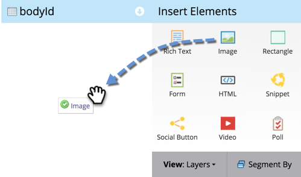

# Hinzufügen eines Bildes zu einer Freiform-Landingpage {#add-an-image-to-a-free-form-landing-page}

>[!PREREQUISITES]
>
>[Hinzufügen von Bildern und Dateien zu Marketo](/help/marketo/product-docs/demand-generation/images-and-files/add-images-and-files-to-marketo.md)

1. Wählen Sie Ihre Freiform-Landingpage aus und klicken Sie auf **[!UICONTROL Entwurf bearbeiten]**.

   

1. Ziehen Sie im Editor über das Element **[!UICONTROL Bild]**.

   

1. Suchen Sie das gewünschte Bild und wählen Sie es aus.

   

1. Klicken Sie auf **[!UICONTROL Einfügen]**.

   

   Gut gemacht! Sie haben soeben ein Bild zu Ihrer Freiform-Landingpage hinzugefügt.

   
