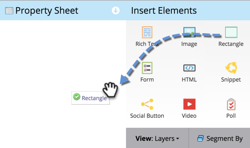

# Hinzufügen eines Rechtecks zu einer Freiform-Landingpage {#adding-a-rectangle-to-a-free-form-landing-page}

Rechtecke auf Landingpages eignen sich hervorragend zum Hervorheben eines Textbereichs.

1. Wählen Sie eine Freiform-Landingpage aus und klicken Sie auf **[!UICONTROL Entwurf]**.

   

   >[!NOTE]
   >
   >Der Freiform-Landingpage-Designer wird in einem neuen Fenster geöffnet.

1. Ziehen Sie über das **[!UICONTROL Rechteck]**-Element.

   

1. Wählen Sie Ihr Rechteck aus und verwenden Sie das **[!UICONTROL Eigenschaftenblatt]**, um die erforderlichen Änderungen vorzunehmen.

   >[!TIP]
   >
   >Sie können das Rechteck per Drag-and-Drop verschieben und in der Größe ändern. Probieren Sie auch die Pfeile auf der Tastatur aus! Hinweis: Drücken Sie die Umschalt-Taste, um das Rechteck um jeweils 10 Pixel zu verschieben.

   

Herzlichen Glückwunsch! Jetzt können Sie auf Ihren Freiform-Landingpages Rechtecke erstellen.
