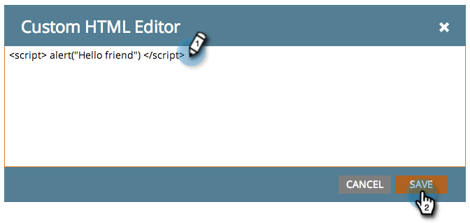

# Hinzufügen von benutzerdefiniertem HTML zu einer Freiform-Landingpage {#adding-custom-html-to-a-free-form-landing-page}

Sie können Landingpages benutzerdefinierte Skripte, CSS oder andere HTML hinzufügen.

>[!NOTE]
>
>Der Marketo-Support ist nicht für die Fehlerbehebung beim benutzerdefinierten HTML eingerichtet. Wenn Sie Hilfe beim HTML benötigen, wenden Sie sich bitte an einen Web-Entwickler.

1. Wählen Sie Ihre Landingpage aus und klicken Sie auf **Entwurf bearbeiten**.

   

1. Ziehen Sie im Landingpage-Editor das Element **HTML** hinein.

   

1. Geben Sie Ihren benutzerdefinierten HTML-Code ein und klicken Sie auf **Speichern**.

   

Schön! Fügen Sie alle gewünschten Skripte oder CSS hinzu.

>[!TIP]
>
>Testen Sie nach Möglichkeit Ihre benutzerdefinierte HTML-Quelle in einer lokalen Umgebung, bevor Sie sie in einer Landingpage bereitstellen.

>[!CAUTION]
>
>Wenn Ihr benutzerdefinierter HTML nicht gerendert werden kann (z. B. eine unsichtbare JavaScript-Funktion oder CSS), platzieren Sie das Element an einer einprägsamen Stelle, z. B. oben links. Die Elementkontur wird nur angezeigt, wenn Sie in ihren Bereich klicken.
