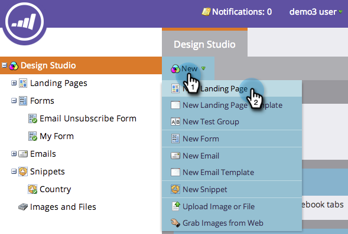

# Erstellen einer Freiform-Landingpage {#create-a-free-form-landing-page}

Freiform-Landingpages können als lokale Assets eines Programms oder im Design Studio erstellt und global verwendet werden.

>[!NOTE]
>
>Landingpage-Modi werden durch ihre Vorlage definiert. [Weitere Informationen](/help/marketo/product-docs/demand-generation/landing-pages/understanding-landing-pages/understanding-free-form-vs-guided-landing-pages.md) über Freiform- und geführte Landingpage-Vorlagen.

## Erstellen einer Freiform-Landingpage in einem Programm {#create-a-free-form-landing-page-in-a-program}

1. Navigieren Sie **Marketing-Aktivitäten**.

   

1. Klicken Sie auf Ihr Programm.

   

1. Klicken Sie auf **Neu**. Wählen Sie **Neues lokales Asset**.

   

1. Klicken Sie auf **Landingpage**.

   

1. Benennen Sie Ihre Landingpage und wählen Sie aus der Dropdown-Liste Freiformvorlage aus.

   >[!NOTE]
   >
   >Vorlagen ohne Symbol sind Freiformvorlagen. Freiformvorlagen ermöglichen eine vollständige Anpassung.

   

1. Klicken Sie auf **Erstellen**.

   

>[!TIP]
>
>Die URL wird automatisch aus den Programm- und Landingpage-Namen erstellt. Um die URL zu ändern, bearbeiten Sie das Feld **Seiten-URL** .

## Erstellen einer Freiform-Landingpage in Design Studio {#create-a-free-form-landing-page-in-design-studio}

1. Gehen Sie zum **Design Studio**.

   

1. Klicken Sie **Neu** und dann **Neue Landingpage**.

   

1. Benennen Sie Ihre Landingpage und wählen Sie aus der Dropdown-Liste Freiformvorlage aus.

   

1. Klicken Sie auf **Erstellen**.

   

>[!TIP]
>
>Deaktivieren Sie „Landingpage-Editor für neue Seite öffnen“, wenn der Editor nicht sofort nach dem Klicken auf &quot;**&quot; geöffnet** soll.
