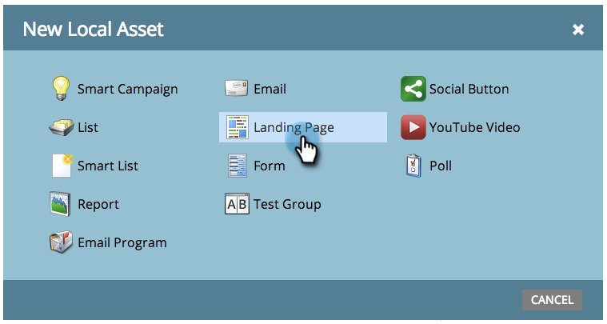

# Erstellen einer Freiform-Landingpage {#create-a-free-form-landing-page}

Freiform-Landingpages können als lokale Assets eines Programms oder in Design Studio erstellt und global verwendet werden.

>[!NOTE]
>
>Landingpages werden durch ihre Vorlage definiert. [Erfahren Sie mehr](../../../../product-docs/demand-generation/landing-pages/understanding-landing-pages/understanding-free-form-vs-guided-landing-pages.md) über die Vorlagen für freie und geführte Landingpages.

## Erstellen einer Freiform-Landingpage in einem Programm {#create-a-free-form-landing-page-in-a-program}

1. Gehen Sie zu **Marketing-Aktivitäten**.

   

1. Klicken Sie auf Ihr Programm.

   

1. Klicken Sie auf **Neu**. Wählen Sie **Neues lokales Asset**.

   

1. Klicken Sie auf **Landingpage**.

   

1. Benennen Sie Ihre Landingpage und wählen Sie eine Freiformvorlage aus der Dropdownliste.

   >[!NOTE]
   >
   >Vorlagen ohne Symbol sind frei. Freiformvorlagen ermöglichen eine vollständige Anpassung.

   

1. Klicken Sie auf **Erstellen**.

   

>[!TIP]
>
>Die URL wird automatisch aus den Programms- und Landingpages-Namen erstellt. Um die URL zu ändern, bearbeiten Sie das Feld **Seiten-URL** .

## Erstellen einer Landingpage mit Freiform in Design Studio {#create-a-free-form-landing-page-in-design-studio}

1. Gehen Sie zum **Design** **Studio**.

   

1. Klicken Sie auf **Neu** und dann auf **Neue Landingpage.**

   

1. Benennen Sie Ihre Landingpage und wählen Sie eine Freiformvorlage aus der Dropdownliste.

   

1. Klicken Sie auf **Erstellen**.

   

>[!TIP]
>
>Deaktivieren Sie &quot;Landingpage-Editor für neue Seite öffnen&quot;, wenn Sie nicht möchten, dass der Editor sofort nach dem Klicken auf **Erstellen** geöffnet wird.

