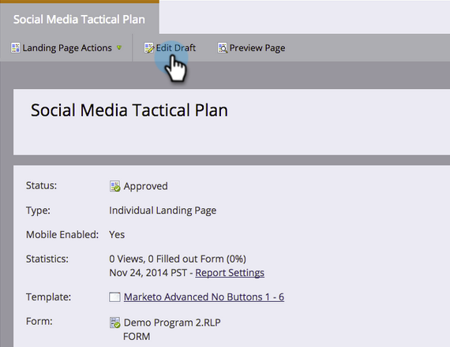

# Mobilansicht für Freiform-Landingpage anpassen {#customize-mobile-view-for-your-free-form-landing-page}

>[!PREREQUISITES]
>
>[Mobilansicht für Ihre Freiform-Landingpage hinzufügen](/help/marketo/product-docs/demand-generation/landing-pages/free-form-landing-pages/add-a-mobile-view-for-your-free-form-landing-page.md)

Die mobile Ansicht Ihrer Freiform-Landingpage ist größtenteils automatisch, Sie können sie jedoch anpassen. So geht&#39;s.

1. Wählen Sie Ihre Freiform-Landingpage aus.

   

1. Klicken Sie **[!UICONTROL Entwurf bearbeiten]**.

   

1. Klicken Sie auf **[!UICONTROL Registerkarte]** Mobil“.

   

## Mobilgeräte im Vergleich zur Desktop-Ansicht {#mobile-vs-desktop-view}

Unter „Seitenelemente“ werden ein  (Desktop) und ein  (Mobilgerät) angezeigt. Auf diese Weise können Sie verschiedene Elemente dynamisch ein- oder ausblenden.

Standardmäßig wird alles, was sich auf der Desktop-Ansicht befindet, auf der mobilen Ansicht angezeigt.

>[!NOTE]
>
>Rechtecke werden in der Mobilansicht nicht angezeigt.

## Wichtige Informationen: {#important-things-to-know}

* Bilder werden auf die Breite des Mobilgeräts erweitert. Wenn Sie kleinere Bilder möchten, ziehen Sie das Rich-Text-Element hinzu und fügen Sie Ihr Bild von dort hinzu.
* Verwenden Sie nur Forms 2.0-Formulare. Sie sind responsiv und passen sich automatisch an.
* Es kann nur ein Vorlagenelement bearbeitet werden: BODY#bodyId (Mobile). Hiermit können Sie die Hintergrundfarbe ändern.

  

## Element in der Mobilansicht ausblenden {#hide-an-element-from-the-mobile-view}

>[!TIP]
>
>Weniger ist mehr auf Mobilgeräten. Verwenden Sie weniger Wörter für zufriedene Kunden.

1. Um ein Element auszublenden, aktivieren Sie das entsprechende Kontrollkästchen unter der Spalte „Mobile“.

   

1. Perfekt! Dieses Element ist in Ihrer Mobilansicht nicht mehr sichtbar.

   

## Element zur Mobilansicht hinzufügen {#add-an-element-to-the-mobile-view}

>[!TIP]
>
>Erstellen Sie spezielle (kürzere) Inhalte nur für die mobile Ansicht.

1. Um ein Element hinzuzufügen, ziehen Sie es per Drag-and-Drop auf die Freiform-Landingpage.

   

   Stellen Sie sicher, dass das Element so eingestellt ist, dass es nur in der Mobilansicht angezeigt wird.

   

>[!TIP]
>
>Die mobile Ansicht kann auch eine andere Anordnung von Seitenelementen aufweisen. Verschieben Sie Elemente auf der Freiform-Landingpage oder ordnen Sie die unter „Seitenelemente **[!UICONTROL aufgelisteten Objekte]** Drag-and-Drop neu an.

## Mobile-Vorschau {#preview-mobile-view}

1. Klicken Sie auf **[!UICONTROL Entwurf in der Vorschau]**.

   

1. Wollen Sie etwas Cooles sehen? Wählen Sie **[!UICONTROL nebeneinander]** aus.

   

1. Sie können jetzt die Desktop- und Mobile-Versionen Ihrer Landingpages gleichzeitig anzeigen!

   

1. Wenn Sie es lieben, klicken Sie auf **[!UICONTROL Genehmigen und schließen]**.

   

   >[!NOTE]
   >
   >Die Vorschau ist nicht interaktiv. Jedes Smartphone zeigt die Dinge etwas anders. Es wird empfohlen, Ihre Landingpage auf einigen Geräten in der Vorschau anzuzeigen, um genau zu sehen, wie sich die Landingpage verhält.

Viel Spaß!

>[!MORELIKETHIS]
>
>[Machen Sie eine vorhandene Freiform-Landingpage-Vorlage mobil kompatibel](/help/marketo/product-docs/demand-generation/landing-pages/landing-page-templates/make-an-existing-free-form-landing-page-template-mobile-compatible.md)
