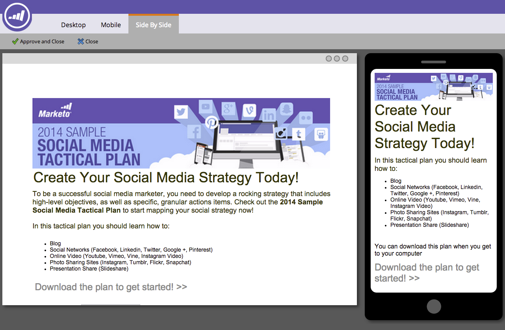

# Anpassen der mobilen Ansicht für Ihre Freiform-Landingpage {#customize-mobile-view-for-your-free-form-landing-page}

>[!PREREQUISITES]
>
>* [hinzufügen einer mobilen Ansicht für Ihre Freiform-Landingpage](add-a-mobile-view-for-your-free-form-landing-page.md)

>

Die mobile Ansicht Ihrer Freiform-Landingpage ist meist automatisch, Sie können sie jedoch anpassen. So geht es.

1. Wählen Sie Ihre Freiform-Landingpage aus.

   

1. Klicken Sie auf **Entwurf bearbeiten**.

   

1. Klicken Sie auf die Registerkarte **Mobil**.

   

## Mobil- oder Desktop-Ansicht {#mobile-vs-desktop-view}

Unter &quot;Seitenelemente&quot;werden ein  (Desktop)-Symbol und ein  (Mobil)-Symbol angezeigt. Auf diese Weise können Sie verschiedene Elemente dynamisch ein-/ausblenden.

Standardmäßig wird alles auf der Desktop-Ansicht auf der mobilen Ansicht angezeigt.

>[!NOTE]
>
>Rechtecke werden auf der mobilen Ansicht nicht angezeigt.

## Wichtige Informationen:  {#important-things-to-know}

* Die Bilder werden bis zur Breite Ihres Mobilgeräts erweitert. Wenn Sie kleinere Bilder benötigen, ziehen Sie das Rich-Text-Element und fügen Sie das Bild von dort hinzu.
* Verwenden Sie nur Forms 2.0-Formulare. Sie reagieren und passen sich automatisch an.
* Es kann nur ein Vorlagenelement bearbeitet werden, BODY#bodyid (Mobil). Auf diese Weise können Sie die Hintergrundfarbe ändern.\
   

## Element aus der Mobile-Ansicht {#hide-an-element-from-the-mobile-view} ausblenden

>[!TIP]
>
>Weniger ist mehr auf Mobilgeräten. Verwenden Sie weniger Wörter für glücklichere Kunden.

1. Um ein Element auszublenden, klicken Sie auf das entsprechende Kontrollkästchen unter der Spalte &quot;Mobil&quot;.

   

1. Perfekt! Dieses Element ist in Ihrer mobilen Ansicht nicht mehr sichtbar.

   

## hinzufügen eines Elements in der Mobile-Ansicht {#add-an-element-to-the-mobile-view}

>[!TIP]
>
>Erstellen Sie spezielle (kürzere) Inhalte nur für die mobile Ansicht.

1. Um ein Element hinzuzufügen, ziehen Sie es per Drag &amp; Drop in die Freiform-Landingpage.

   

   Stellen Sie sicher, dass das Element so eingestellt ist, dass es nur auf der mobilen Ansicht angezeigt wird.

   

>[!TIP]
>
>Die mobile Ansicht kann auch eine andere Anordnung von Seitenelementen aufweisen. Verschieben Sie die Elemente auf der Landingpage &quot;Freiform&quot;oder ordnen Sie die unter **Seitenelemente** aufgelisteten Objekte per Drag &amp; Drop neu an.

## Vorschau Mobile Ansicht {#preview-mobile-view}

1. Klicken Sie auf **Vorschau Draft**.

   

1. Willst du etwas Cooles sehen? Wählen Sie **Seite nach Seite**.

   

1. Sie können jetzt die Desktop- und Mobilversionen Ihrer Landingpages gleichzeitig sehen!

   

1. Wenn Sie es lieben, klicken Sie auf **Genehmigen und Schließen**.

   

   >[!NOTE]
   >
   >Die Vorschau ist nicht interaktiv. Jedes Smartphone zeigt Dinge etwas anders an. Es wird empfohlen, eine Vorschau Ihrer Landingpage auf einigen Geräten anzuzeigen, um zu sehen, wie sich die Landingpage genau verhält.

Viel Spaß!

>[!NOTE]
>
>**Verwandte Artikel**
>
>* [Vorhandene Vorlage für eine Landingpage mit Freiform Mobile kompatibel machen](../../../../product-docs/demand-generation/landing-pages/landing-page-templates/make-an-existing-free-form-landing-page-template-mobile-compatible.md)

>

