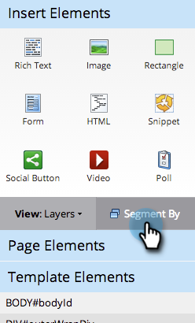

# Verwenden dynamischer Inhalte in einer Freiform-Landingpage {#use-dynamic-content-in-a-free-form-landing-page}

Die Verwendung von dynamischen Inhalten auf Landingpages bindet Ihre Zielgruppe mit zielgerichteten Informationen an.

>[!PREREQUISITES]
>
>* [Erstellen einer Segmentierung](/help/marketo/product-docs/personalization/segmentation-and-snippets/segmentation/create-a-segmentation.md)
>* [Erstellen einer Freiform-Landingpage](/help/marketo/product-docs/demand-generation/landing-pages/free-form-landing-pages/create-a-free-form-landing-page.md)
>* [Hinzufügen eines neuen Formulars zu einer Freiform-Einstiegsseite](/help/marketo/product-docs/demand-generation/landing-pages/free-form-landing-pages/add-a-new-form-to-a-free-form-landing-page.md)

## Segmentierung hinzufügen {#add-segmentation}

1. Wechseln Sie zu **Marketingaktivitäten**.

   

1. Wählen Sie Ihre Landingpage aus und klicken Sie dann auf **Entwurf bearbeiten**.

   

1. Klicken Sie auf **Segment nach**.

   

1. Geben Sie den Segmentierungsnamen ein und klicken Sie auf **Speichern**.

   

1. Ihre Segmentierung und ihre Segmente werden rechts unter Dynamisch angezeigt.

   

>[!NOTE]
>
>Alle Landingpage-Elemente sind standardmäßig statisch.

## Element dynamisch machen {#make-element-dynamic}

1. Ziehen Sie die dynamischen Inhaltselemente von unter &quot;**Statisch**&quot;in &quot;**Dynamisch**&quot;.

   

1. Sie können die Elemente **Statisch** oder **Dynamisch** auch aus dem Element **Einstellungen** erstellen.

   

## Dynamische Inhalte anwenden {#apply-dynamic-content}

1. Wählen Sie ein Element unter einem Segment aus, klicken Sie auf das Einstellungssymbol und dann auf **Bearbeiten**. Wiederholen Sie diesen Vorgang für jedes Segment.

   

1. Ein grünes Häkchen zeigt den für dieses Segment spezifischen Inhalt an. Ein leeres Feld zeigt den Standardinhalt des Segments an.

   

>[!CAUTION]
>
>Änderungen am Inhaltsbaustein für Standardsegmente werden auf alle Segmente angewendet.

>[!TIP]
>
>Erstellen Sie eine Standard-Landingpage, bevor Sie den Inhalt für die verschiedenen Segmente ändern.

Voila! Jetzt können Sie zielgerichtete Inhalte versenden.

>[!MORELIKETHIS]
>
>* [Anzeigen einer Vorschau einer Landingpage mit dynamischem Inhalt](/help/marketo/product-docs/demand-generation/landing-pages/landing-page-actions/preview-a-landing-page-with-dynamic-content.md)
>* [Verwenden dynamischer Inhalte in einer E-Mail](/help/marketo/product-docs/email-marketing/general/functions-in-the-editor/using-dynamic-content-in-an-email.md)
