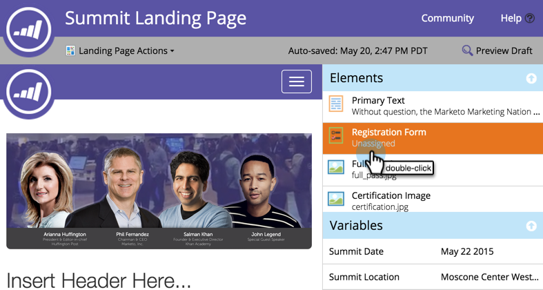
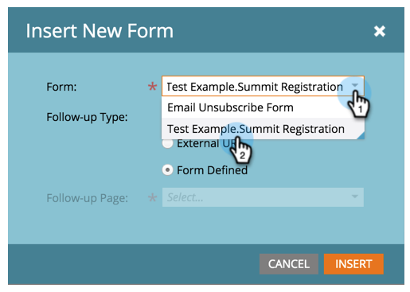
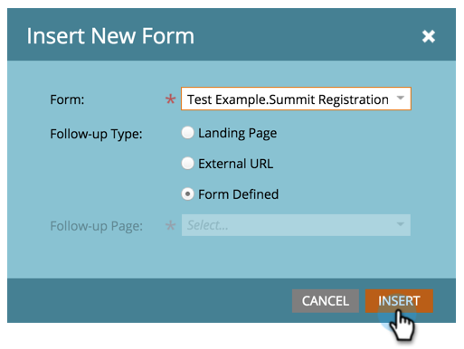

# Hinzufügen eines Formulars zu einer geführten Landingpage {#add-a-form-to-a-guided-landing-page}

>[!PREREQUISITES]
>
>[Erstellen einer geführten Landingpage](/help/marketo/product-docs/demand-generation/landing-pages/guided-landing-pages/create-a-guided-landing-page.md)

1. Navigieren Sie zum Bereich **[!UICONTROL Marketing-Aktivitäten]**.

   

1. Suchen Sie Ihre Landingpage, wählen Sie sie aus und klicken Sie auf **[!UICONTROL Entwurf bearbeiten]**.

   

   >[!NOTE]
   >
   >Verfügbare Elemente in geführten Landingpages werden durch die Vorlage definiert. Wenn im Bedienfeld Elemente kein Formular angezeigt wird, wählen Sie eine neue Vorlage aus oder wenden Sie sich an Ihren Vorlagenersteller.

1. Doppelklicken Sie auf das **Formular** im Bedienfeld „Element“.

   

1. Wählen Sie das Formular aus, das Sie hinzufügen möchten.

   

1. Bei der Auswahl Ihrer Folgenachricht stehen Ihnen drei Optionen zur Verfügung:

   * **[!UICONTROL Landingpage]** - Eine Marketo-Landingpage auswählen
   * **[!UICONTROL Externe URL]** - Wählen Sie eine beliebige URL aus
   * **[!UICONTROL Formular definiert]** - verwendet die auf Formularebene definierten Einstellungen.

   >[!NOTE]
   >
   >Die Folgeseite ist die Seite, die die Personen sehen, nachdem sie das Formular gesendet haben.

1. Wählen Sie in diesem Beispiel [!UICONTROL Formular definiert] aus. Klicken Sie auf **[!UICONTROL Einfügen]**.

   

   

Schließen Sie den Landingpage-Editor und [ Sie den Landingpage-Entwurf ](/help/marketo/product-docs/demand-generation/landing-pages/understanding-landing-pages/approve-unapprove-or-delete-a-landing-page.md).
