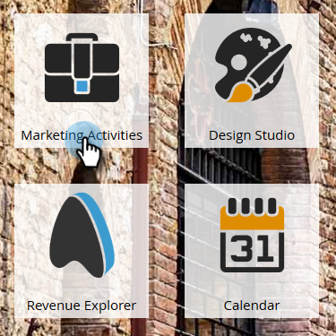

# Hinzufügen eines Formulars zu einer geführten Landingpage {#add-a-form-to-a-guided-landing-page}

Formular, Landingpage kennenlernen. Landingpage, Formular erfüllen.

>[!PREREQUISITES]
>
>[Erstellen einer geführten Landingpage](/help/marketo/product-docs/demand-generation/landing-pages/guided-landing-pages/create-a-guided-landing-page.md)

1. Wechseln Sie zum Bereich **Marketingaktivitäten** .

   

1. Suchen und wählen Sie Ihre Landingpage aus und klicken Sie auf **Entwurf bearbeiten**.

   

   >[!NOTE]
   >
   >Verfügbare Elemente in geführten Landingpages werden durch die Vorlage definiert. Wenn kein Formular im Bedienfeld &quot;Elemente&quot;angezeigt wird, wählen Sie eine neue Vorlage aus oder sprechen Sie mit dem Ersteller der Vorlage.

1. Doppelklicken Sie im Elementbereich auf das **Formular** .

   

1. Wählen Sie das Formular aus, das Sie hinzufügen möchten.

   

1. Sie haben bei der Auswahl Ihrer Nachverfolgungsseite drei Optionen:

   * Landingpage - Wählen Sie eine Marketo-Landingpage aus
   * Externe URL - wählen Sie eine beliebige URL aus
   * Definiertes Formular - Verwenden Sie die auf Formularebene definierten Einstellungen

   >[!NOTE]
   >
   >Die Folgenachricht ist die Seite, die Benutzer sehen, nachdem sie das Formular gesendet haben.

1. In diesem Beispiel verwenden wir Formular definiert. Klicken Sie auf **Einfügen**.

   

   Schön gemacht!

   

Schließen Sie jetzt einfach den Landingpage-Editor und [genehmigen Sie den Landingpage-Entwurf](/help/marketo/product-docs/demand-generation/landing-pages/understanding-landing-pages/approve-unapprove-or-delete-a-landing-page.md).
