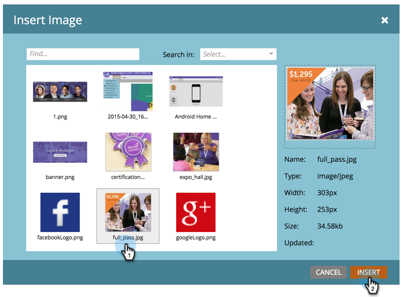
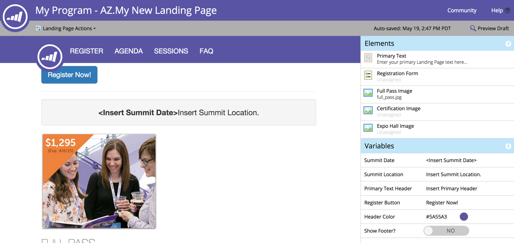

# Hinzufügen eines Bildes zu einer geführten Landingpage {#add-an-image-to-a-guided-landing-page}

Im Gegensatz zu den Freiform-Landingpages verfügen geführte Landingpages über vordefinierte, gesperrte Bereiche, in denen Sie Bilder hinzufügen.

1. Auswahl einer geführten Landingpage. Klicken Sie **[!UICONTROL Entwurf bearbeiten]**.

   

1. Klicken Sie auf das Bild, das Sie bearbeiten möchten. Der Platzhalter für das Element wird auf der Arbeitsfläche der Landingpage aufleuchten.

   

1. Wählen Sie das gewünschte Bild aus und klicken Sie auf **[!UICONTROL Einfügen]**.

   

1. Der Inhalt wird im Platzhalter des Elements angezeigt.

   >[!NOTE]
   >
   >Wie die Bildgröße geändert wird, hängt von der Vorlage ab. Weitere Informationen zu [Geführte Landingpage-Vorlagen](/help/marketo/product-docs/demand-generation/landing-pages/landing-page-templates/create-a-guided-landing-page-template.md).

   

   >[!TIP]
   >
   >Die Angabe eines Links für ein Bild im Editor wird derzeit nicht unterstützt. Verwenden Sie stattdessen ein Rich-Text-Element.
