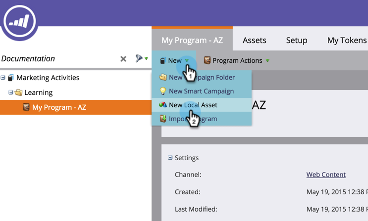

# Erstellen einer geführten Landingpage {#create-a-guided-landing-page}

>[!NOTE]
>
>Landingpage-Modi werden durch ihre Vorlage definiert. [Erfahren Sie mehr](/help/marketo/product-docs/demand-generation/landing-pages/understanding-landing-pages/understanding-free-form-vs-guided-landing-pages.md) über Vorlagen für freie und geführte Landingpages.

>[!PREREQUISITES]
>
>Um eine benutzerdefinierte Vorlage zu verwenden, müssen Sie zunächst [eine Vorlage für eine geführte Landingpage erstellen](/help/marketo/product-docs/demand-generation/landing-pages/landing-page-templates/create-a-guided-landing-page-template.md).

## Erstellen einer geführten Landingpage in einem Programm {#create-a-guided-landing-page-in-a-program}

Geführte Landingpages können als lokale Assets eines Programms oder in Design Studio erstellt und global verwendet werden.

1. Wechseln Sie zu **Marketingaktivitäten**.

   

1. Wählen Sie Ihr Programm aus.

   

1. Klicken Sie auf das Dropdown-Menü **Neu** . Wählen Sie **Neues lokales Asset** aus.

   

1. Wählen Sie **Landingpage** aus.

   

1. Benennen Sie Ihre Landingpage. Klicken Sie auf das Dropdown-Menü **Vorlage** und wählen Sie **Geführte Vorlage** aus.

   >[!NOTE]
   >
   >Geführte Landingpage-Vorlagen haben neben ihnen das Symbol . Geführte Vorlagen sind so strukturiert, dass sie vollständig responsiv bleiben können.

   

## Erstellen einer Landingpage in Design Studio {#create-a-landing-page-in-design-studio}

1. Wechseln Sie zu **Design Studio**.

   

1. Klicken Sie auf das Dropdown-Menü **Neu** . Wählen Sie **Neue Landingpage** aus.

   

1. Benennen Sie Ihre Landingpage. Klicken Sie auf das Dropdown-Menü **Vorlage** und wählen Sie **Geführte Vorlage** aus.

   

1. Klicken Sie auf **Erstellen**.

   

>[!TIP]
>
>Die URL wird automatisch aus den Namen des Programms und der Landingpage erstellt. Um die URL zu ändern, bearbeiten Sie das Feld **Seiten-URL** .
>
>Deaktivieren Sie das Kontrollkästchen **Im Editor öffnen** , wenn Sie nicht möchten, dass der Editor sofort nach Klicken auf **Erstellen** geöffnet wird.
