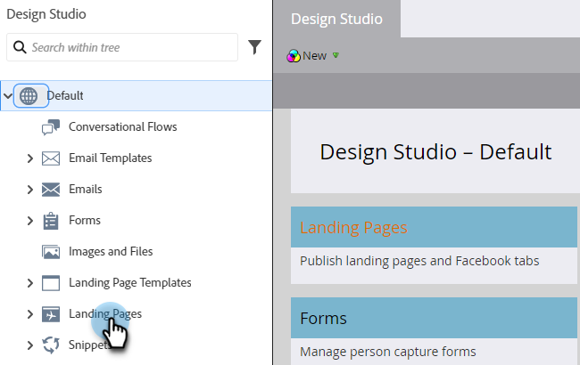

# Gleichzeitiges Genehmigen mehrerer Landingpages {#approve-multiple-landing-pages-at-once}

1. Wechseln Sie zu **[!UICONTROL Design Studio]**.

   

1. Klicken Sie auf **[!UICONTROL Landingpages]**.

   

1. Wählen Sie die gewünschten Landingpages aus.

   

   >[!TIP]
   >
   >Klicken Sie nicht auf den tatsächlichen Landingpage-Namen. Dies sind Links, über die Sie zur eigentlichen Landingpage gelangen.

1. Klicken Sie bei ausgewählten Landingpages auf die Dropdown-Liste **Landingpage-Aktionen** und wählen Sie **Genehmigen**.

   

1. Klicken Sie **Genehmigen**.

   

   >[!TIP]
   >
   >Sie können die obigen Schritte auch für andere Massenoptionen verwenden, z. B. zum Aufheben der Genehmigung oder zum Löschen.
