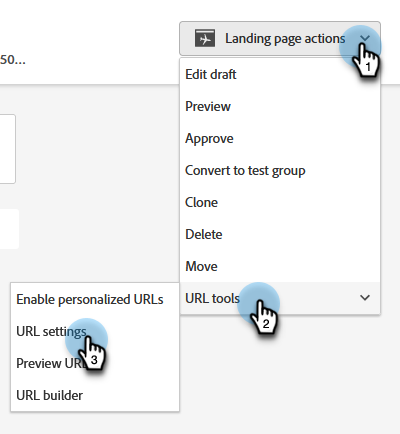

# Ändern der Landingpage-URL {#change-the-landing-page-url}

Sie können die URL einer Landingpage ändern. Dies kann dazu beitragen, die URL einfacher zu merken und die SEO zu verbessern.

1. Suchen und wählen Sie die gewünschte Landingpage aus.

   

1. Klicken Sie auf die **Landingpage-Aktionen**, scrollen Sie zu **URL-** und wählen Sie **URL-Einstellungen** aus.

   

1. Geben Sie die **[!UICONTROL Neue URL]** ein, wählen Sie, ob die alte URL verworfen oder umgeleitet werden soll, und klicken Sie auf **[!UICONTROL Speichern]**.

   

   >[!NOTE]
   >
   >Wenn Sie beide URLs beibehalten möchten, wird automatisch eine Umleitungsregel erstellt. Weitere Informationen zu [URL-Umleitungen](/help/marketo/product-docs/demand-generation/landing-pages/personalizing-landing-pages/redirect-a-url-path.md).
