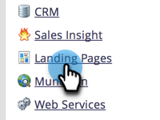
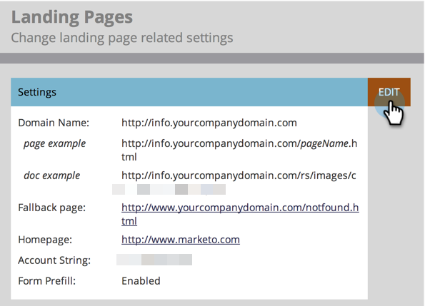
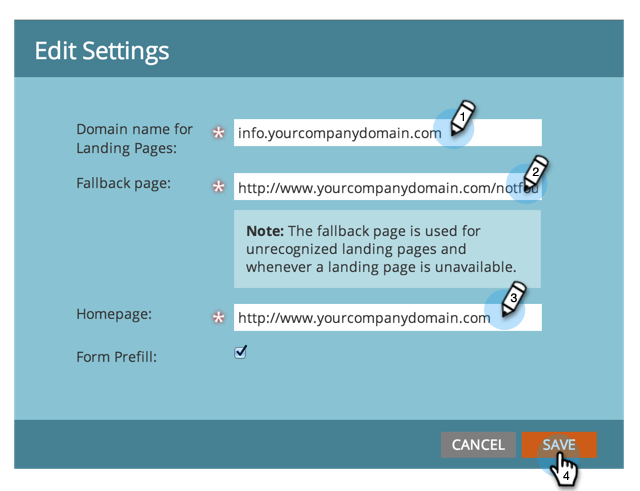

# Benutzerdefinierte Landingpage-URLs mit einem CNAME {#customize-your-landing-page-urls-with-a-cname}

Obwohl Marketo Ihre Landingpages hostet, kann die URL vollständig angepasst werden. Wie es ohne CNAME aussieht:

`https://na-sj02.marketo.com/lp/mktodemoaccount126/UnsubscribePage.html`

So sollte es aussehen:

`https://go.YourCompany.com/UnsubscribePage.html`

## CNAME auswählen {#choose-a-cname}

Wählen Sie ein Wort, das am Anfang der URL Ihrer Landingpages stehen soll. Es ist nur ein Wort und sollte relativ kurz sein. Beispiele:

* go.YourCompany.com/NameOfPage.html
* info.YourCompany.com/NameOfPage.html
* pages.YourCompany.com/NameOfPage.html

Das eine Wort (plus YourCompany.com) wird als CNAME bezeichnet. Sie werden das später benötigen. Notieren Sie es sich also.

## Ermitteln der Munchkin ID {#find-your-munchkin-id}

1. Navigieren Sie zum Bereich **Admin**.

   

1. Klicken Sie auf **Mein Konto**.

   

   >[!NOTE]
   >
   >**Admin-Berechtigungen erforderlich**

1. Scrollen Sie nach unten zu „Support-Informationen“ und kopieren Sie Ihre Munchkin ID.

   

## Anforderung an IT senden {#send-request-to-it}

Bitten Sie Ihre IT-Mitarbeiter, den folgenden CNAME einzurichten: (Ersetzen Sie [ Wort „CNAME] und [Munchkin ID] durch den Text aus dem vorherigen Schritt.)

[CNAME].YourCompany.com > [Munchkin ID].mktoweb.com

## Abschließen der CNAME-Einrichtung {#complete-cname-setup}

1. Sobald Ihre IT den CNAME erstellt hat, wechseln Sie zum Bereich **Admin** .

   

1. Klicken Sie auf **Landingpages**.

   

1. Klicken **im Abschnitt** auf **Bearbeiten**.

   

1. Geben Sie Ihren CNAME in **[!UICONTROL Domain-Name für Landingpages]**, Ihre **[!UICONTROL Ausweisseite]**, Ihre **[!UICONTROL Homepage]** ein und klicken Sie auf **[!UICONTROL Speichern]**.

   

>[!NOTE]
>
>Ihre Fallback-Seite ist die Seite, auf die Leads weitergeleitet werden, wenn Ihre Marketo-Landingpage nicht verfügbar ist.

Ihre Landingpages sind jetzt mit der Domain Ihres Unternehmens gekennzeichnet.
