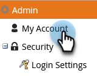

# Anpassen der Landingpage-URLs mit einem CNAME {#customize-your-landing-page-urls-with-a-cname}

Auch wenn Marketo Ihre Landingpages hostet, kann die URL vollständig angepasst werden. Wie es ohne CNAME aussieht:

`https://na-sj02.marketo.com/lp/mktodemoaccount126/UnsubscribePage.html`

So sollte es aussehen:

`https://go.YourCompany.com/UnsubscribePage.html`

## CNAME auswählen {#choose-a-cname}

Wählen Sie ein Wort aus, um am Anfang der URL für Ihre Landingpages zu gehen. Es ist nur ein Wort und sollte relativ kurz sein. Beispiele:

* go.YourCompany.com/NameOfPage.html
* info.YourCompany.com/NameOfPage.html
* pages.YourCompany.com/NameOfPage.html

Das eine Wort (plus YourCompany.com) wird als CNAME bezeichnet. Sie werden dies später benötigen, damit Sie es sich notieren können.

## Munchkin-ID suchen {#find-your-munchkin-id}

1. Wechseln Sie zum Bereich **Admin** .

   

1. Klicken Sie auf **Mein Konto**.

   

   >[!NOTE]
   >
   >**Erforderliche Administratorberechtigungen**

1. Scrollen Sie nach unten zu &quot;Support-Informationen&quot;und kopieren Sie Ihre Munchkin-ID.

   

## Anfrage an IT senden {#send-request-to-it}

Bitten Sie Ihre IT-Mitarbeiter, den folgenden CNAME einzurichten: (Ersetzen Sie das Wort [CNAME] und [Munchkin ID] durch den Text aus dem vorherigen Schritt.)

[CNAME].YourCompany.com > [Munchkin ID].mktoweb.com

## Vollständige CNAME-Einrichtung {#complete-cname-setup}

1. Nachdem Ihr IT-Mitarbeiter den CNAME erstellt hat, wechseln Sie zum Bereich **Admin** .

   

1. Klicken Sie auf **Landingpages**.

   

1. Klicken Sie unter dem Abschnitt **Einstellungen** auf **Bearbeiten**.

   

1. Geben Sie Ihren CNAME in **Domänennamen für Einstiegsseiten** ein, geben Sie Ihre **Fallback-Seite** ein, geben Sie Ihre **Homepage** ein und klicken Sie auf **Speichern**.

   

>[!NOTE]
>
>Ihre Fallback-Seite ist die Seite, an die Leads weitergeleitet werden, wenn Ihre Marketo-Landingpage nicht verfügbar ist.

Gut gemacht! Ihre Landingpages sind jetzt mit Ihrer Unternehmensdomäne gekennzeichnet.
