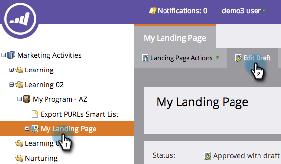
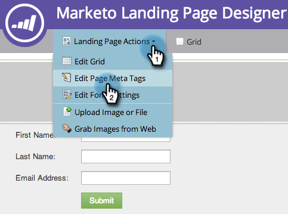
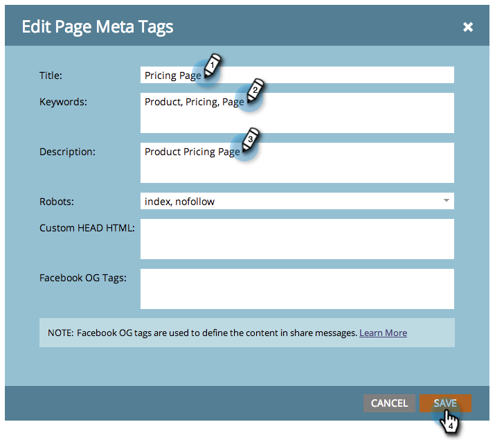

# Bearbeiten von Titel und Metadaten einer Landingpage {#edit-landing-page-title-and-metadata}

Mit Marketo können Sie die [Meta-Tags Ihrer Landingpage für SEO-Zwecke ](https://www.w3schools.com/tags/tag_meta.asp) und den `<head>` Teil der HTML anpassen.

1. Wählen Sie eine Landingpage aus und klicken Sie auf **[!UICONTROL Entwurf bearbeiten]**.

   

   >[!NOTE]
   >
   >Der Landingpage-Designer wird in einem neuen Fenster geöffnet.

1. Klicken **[!UICONTROL unter „Landingpage-Aktionen]** auf **[!UICONTROL Seite bearbeiten Meta Tags]**.

   

1. Geben Sie **[!UICONTROL Titel]**, **[!UICONTROL Keywords]** und **[!UICONTROL Beschreibung]** für Ihre Seite ein. Wählen Sie die gewünschte Option **[!UICONTROL Robots]** aus und geben Sie benutzerdefinierte Inhalte ein, die Sie für den Abschnitt HTML-`<head>` verwenden möchten. Klicken Sie auf **[!UICONTROL Speichern]**.

   

   >[!TIP]
   >
   >**Was bedeutet [Roboter](https://www.robotstxt.org/meta.html)?**
   >
   >**index**: Die Seite kann im Web durchsucht werden. **follow**: Suchmaschinen können Links auf indizierten Seiten folgen.

1. Bearbeiten Sie die Tags jederzeit und genehmigen Sie die Landingpage.
