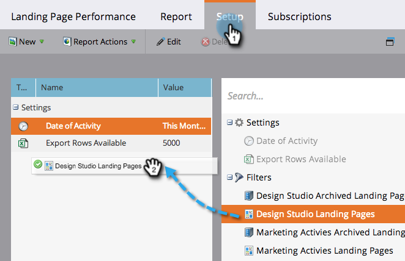
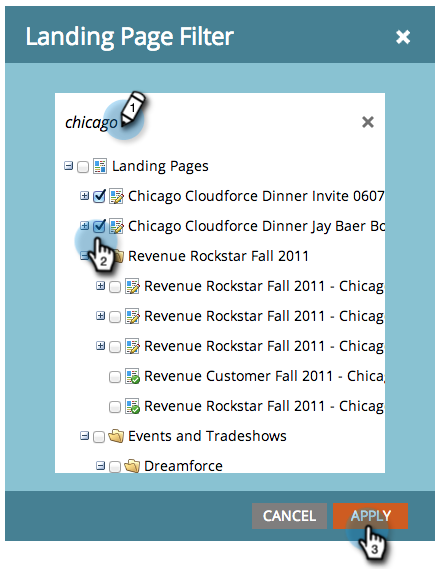

# Filtern eines Landingpage-Leistungsberichts {#filter-a-landing-page-performance-report}

Konzentrieren Sie Ihren [Bericht zur Leistung der Landingpage](/help/marketo/product-docs/demand-generation/landing-pages/understanding-landing-pages/landing-page-performance-report.md) auf Landingpages in Ihren Programmen (lokale Assets), auf die in [!UICONTROL Design Studio] (globale Assets) oder auf die archivierten Seiten.

1. Navigieren Sie **[!UICONTROL Analytics]** (oder **[!UICONTROL Marketing-Aktivitäten]**).

   

1. Wählen Sie Ihren Landingpage-Bericht über die Navigationsstruktur aus.

   

1. Klicken Sie auf **[!UICONTROL Setup]** und ziehen Sie einen Filter hinein.

   

   * **[!UICONTROL Design Studio-Landingpages]:** Globale Assets, verwaltet im [!UICONTROL Design Studio].
   * **[!UICONTROL Landingpages für Marketing-Aktivitäten]:** Lokale Assets in Programmen auf der Registerkarte [!UICONTROL Marketing-Aktivitäten].
   * **[!UICONTROL Archivierte Landingpages]:** inaktive, eingestellte Landingpages.

1. Wählen Sie die Ordner und spezifischen Landingpages aus, die in Ihren Bericht aufgenommen werden sollen.

   

   >[!TIP]
   >
   >Wenn Sie einen Ordner auswählen, enthält der Bericht zum Zeitpunkt der Berichtsausführung alles, was dieser Ordner enthält.

1. Du bist fertig! Klicken Sie auf **[!UICONTROL Bericht]**, um Ihren gefilterten Bericht anzuzeigen.

   
