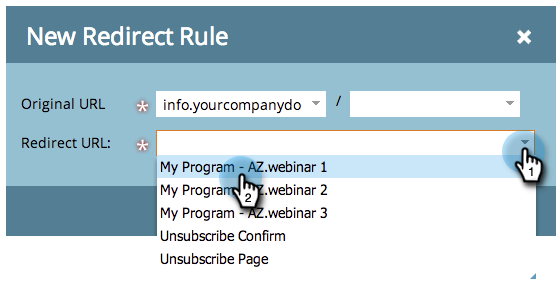

# Umleiten einer Marketo-Landingpage zu einer anderen Seite {#redirect-a-marketo-landing-page-to-another-page}

Wenn Sie jemals die URL einer Seite aktualisieren und möchten, dass die alte URL weiterhin funktioniert, versuchen Sie es mit einer Umleitung! Die Einrichtung ist einfach.

>[!NOTE]
>
>**Admin-Berechtigungen erforderlich**

1. Klicken **[!UICONTROL unter]** auf **[!UICONTROL Landingpages]**.

   

1. Klicken Sie auf der **[!UICONTROL Regeln]** auf **[!UICONTROL Neu]** und dann auf **[!UICONTROL Neue Umleitungsregel]**.

   

1. Klicken Sie auf die erste **[!UICONTROL Original-URL]** Dropdown-Liste und wählen Sie Ihren Marketo [CNAME](/help/marketo/product-docs/demand-generation/landing-pages/landing-page-actions/customize-your-landing-page-urls-with-a-cname.md).

   

   >[!NOTE]
   >
   >Denken Sie daran, dass Sie nur URLs umleiten können, die mit Ihrem Marketo ([) &#x200B;](/help/marketo/product-docs/demand-generation/landing-pages/landing-page-actions/customize-your-landing-page-urls-with-a-cname.md).

1. Wählen Sie die Landingpage, die Sie umleiten möchten, im zweiten Feld **[!UICONTROL Ursprüngliche URL]** aus.

   

   >[!NOTE]
   >
   >Sie können einen beliebigen URL-Pfad eingeben, auch wenn die Seite oder das Verzeichnis nicht vorhanden ist.

1. Klicken Sie auf **[!UICONTROL Dropdown-]** „Umleitungs-URL“ und wählen Sie die Seite aus, zu der Sie Besucher umleiten möchten.

   

1. Klicken Sie auf **[!UICONTROL Erstellen]**.

   

   >[!TIP]
   >
   >Um zu einer Web-Seite außerhalb von Marketo umzuleiten, klicken Sie auf **[!UICONTROL Nicht-Marketo-Landingpage verwenden]**.

   >[!MORELIKETHIS]
   >
   >[URL-Pfad umleiten](/help/marketo/product-docs/demand-generation/landing-pages/personalizing-landing-pages/redirect-a-url-path.md)
