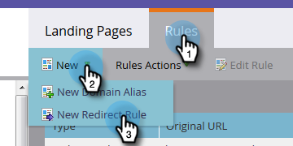

# Umleiten einer Landingpage zu einer anderen Seite {#redirect-a-marketo-landing-page-to-another-page}

Wenn Sie die URL einer Seite aktualisieren und die alte URL trotzdem funktionieren soll, versuchen Sie eine Umleitung! Das Einrichten ist einfach.

>[!NOTE]
>
>**Administratorberechtigungen erforderlich**

1. Klicken Sie unter **Admin** auf **Einstieg** **Seiten**.

   

1. Klicken Sie unter der Registerkarte **Regeln** auf **Neu** und dann auf **Neu** **Umleiten** **Regel**.

   

1. Klicken Sie auf die Dropdown-Liste **first** **Original** **URL** und wählen Sie Ihr Marketo [CNAME](customize-your-landing-page-urls-with-a-cname.md).

   

   >[!NOTE]
   >
   >**Erinnerung**
   >
   >
   >Denken Sie daran, dass Sie nur URLs umleiten können, die mit Ihrem Beginn zu [CNAME](customize-your-landing-page-urls-with-a-cname.md) umgeleitet werden.

1. Wählen Sie im Feld **zweite Original-URL** die Landingpage aus, die Sie umleiten möchten.

   

   >[!NOTE]
   >
   >Sie können einen beliebigen URL-Pfad eingeben, auch wenn die Seite oder das Verzeichnis nicht vorhanden ist.

1. Klicken Sie auf die Dropdownliste **Umleiten** **URL** und wählen Sie die Seite aus, zu der Sie Besucher umleiten möchten.

   

1. Klicken Sie auf **Erstellen**.

   

   >[!TIP]
   >
   >Um zu einer Webseite außerhalb von Marketo umzuleiten, klicken Sie auf **Nicht-Marketo-Landingpage verwenden**.

   >[!NOTE]
   >
   >**Verwandte Artikel**
   >
   >    
   >    
   >    * [Umleiten eines URL-Pfads](../../../../product-docs/demand-generation/landing-pages/personalizing-landing-pages/redirect-a-url-path.md)

Kick deine Fersen auf, Marketing Held, du bist fertig!