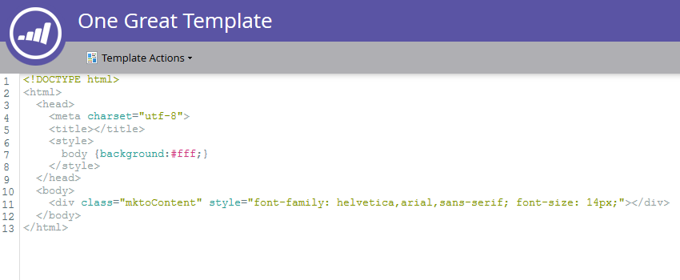

# Erstellen einer Freiform-Landingpage-Vorlage {#create-a-free-form-landing-page-template}

Freiform-Landingpages erfordern weniger technisches Wissen als deren geführte Gegenstücke. Gehen Sie wie folgt vor, um eine Vorlage für zukünftige Landingpages zu erstellen.

1. Wechseln Sie zu **[!UICONTROL Design Studio]**.

   

1. Klicken Sie **[!UICONTROL Neu]** und wählen Sie **[!UICONTROL Neue Landingpage-Vorlage]**.

   

1. Wählen Sie Ihren Ordner aus und geben Sie Ihrer Vorlage einen Namen. Der Standardbearbeitungsmodus ist Freiform. Nachdem Sie Ihre Vorlage benannt haben, klicken Sie auf **[!UICONTROL Erstellen]**.

   

1. Ihre Vorlage sollte auf einer neuen Registerkarte geöffnet werden. Sie kann jetzt von allen bearbeitet werden, die mit CSS/HTML vertraut sind.

   

   >[!NOTE]
   >
   >Der Marketo-Support ist nicht für die Fehlerbehebung bei benutzerdefiniertem HTML eingerichtet. Wenn Sie Hilfe zu HTML benötigen, wenden Sie sich bitte an einen Web-Entwickler.

1. Wenn Sie Ihre Änderungen vorgenommen haben, klicken Sie auf **[!UICONTROL Vorlagenaktionen]** und wählen Sie dann **[!UICONTROL Genehmigen und schließen]**.

   

   Sie haben jetzt eine neue Freiform-Landingpage-Vorlage!

   >[!NOTE]
   >
   >Wählen Sie **[!UICONTROL Munchkin-Tracking deaktivieren]** aus, wenn Sie verhindern möchten, dass Formulare vorab ausgefüllt werden, oder wenn Sie nur das Webverhalten auf einer bestimmten Seite nicht verfolgen möchten.\
   >Wählen Sie **[!UICONTROL Kompatibilität für Mobilgeräte überprüfen]**, um sicherzustellen, dass Ihr Code mit Mobilgeräten kompatibel ist.

   >[!MORELIKETHIS]
   >
   >* [Erstellen einer Freiform-Landingpage](/help/marketo/product-docs/demand-generation/landing-pages/free-form-landing-pages/create-a-free-form-landing-page.md)
   >* [Erstellen einer geführten Landingpage-Vorlage](/help/marketo/product-docs/demand-generation/landing-pages/landing-page-templates/create-a-guided-landing-page-template.md)
   >* [Grundlegendes zu Freiform und geführten Landingpages](/help/marketo/product-docs/demand-generation/landing-pages/understanding-landing-pages/understanding-free-form-vs-guided-landing-pages.md)
