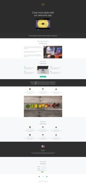

# Liste der geführten Landingpage-Vorlagen {#guided-landing-page-template-list}

Durchsuchen Sie unsere Sammlung von Beispielvorlagen zur Verwendung mit dem [Geführter Landingpage-Editor](/help/marketo/product-docs/demand-generation/landing-pages/guided-landing-pages/create-a-guided-landing-page.md). Jede Vorlage ist vollständig responsiv und basiert auf dem Bootstrap-Framework.

>[!NOTE]
>
>Der Marketo-Support ist nicht für die Fehlerbehebung bei HTML eingerichtet. Wenn Sie Hilfe beim Ändern dieser Vorlagen benötigen, wenden Sie sich an einen Webentwickler.

So importieren Sie eine Vorlage in Marketo:

1. Klicken Sie für eine größere Ansicht auf den Namen der Vorlage.
1. Laden Sie die ausgewählte Vorlage herunter.
1. Navigieren Sie in Marketo zum **Design Studio.**
1. Klicken **Landing Pages** Wählen Sie im linken Baum **Vorlagen.**

1. Klicken Sie in der Menüleiste auf **Importvorlage.**
1. Wählen Sie die heruntergeladene Datei aus, geben Sie einen Vorlagennamen ein und klicken Sie auf **Import** (Achten Sie darauf, einen beschreibenden Namen auszuwählen und anzugeben, dass der Bearbeitungsmodus **Geführt**).

|  |  |  |
|---|---|---|
| [Vorlage 1A](guided-landing-page-templates/template-1a.md) | [Vorlage 1B](guided-landing-page-templates/template-1b.md) | [Vorlage 1C](guided-landing-page-templates/template-1c.md) |
|  |  |  |
| [Vorlage 1D](guided-landing-page-templates/template-1d.md) | [Vorlage 1E](guided-landing-page-templates/template-1e.md) | [Vorlage 1f](guided-landing-page-templates/template-1f.md) |
|  |  |  |
| [Vorlage 2A](guided-landing-page-templates/template-2a.md) | [Vorlage 2B](guided-landing-page-templates/template-2b.md) | [Vorlage 2C](guided-landing-page-templates/template-2c.md) |
|  |  |  |
| [Vorlage 2D](guided-landing-page-templates/template-2d.md) | [Vorlage 3A](guided-landing-page-templates/template-3a.md) | [Vorlage 3B](guided-landing-page-templates/template-3b.md) |
|  |  |  |
| [Vorlage 3C](guided-landing-page-templates/template-3c.md) | [Vorlage 3D](guided-landing-page-templates/template-3d.md) | [Vorlage 4A](guided-landing-page-templates/template-4a.md) |
|  |  |  |
| [Vorlage 4B](guided-landing-page-templates/template-4b.md) | [Vorlage 4C](guided-landing-page-templates/template-4c.md) | [Vorlage 5A](guided-landing-page-templates/template-5a.md) |
|  |  |  |
| [Vorlage 5B](guided-landing-page-templates/template-5b.md) | [Vorlage 5C](guided-landing-page-templates/template-5c.md) | [Vorlage 5D](guided-landing-page-templates/template-5d.md) |
|  |  |  |
| [Vorlage 5E](guided-landing-page-templates/template-5e.md) | [Vorlage 6A](guided-landing-page-templates/template-6a.md) | [Vorlage 6B](guided-landing-page-templates/template-6b.md) |
|  |  |  |
| [Vorlage 6C](guided-landing-page-templates/template-6c.md) | [Vorlage 6D](guided-landing-page-templates/template-6d.md) | [Vorlage 6E](guided-landing-page-templates/template-6e.md) |
|  |  |  |
| [Vorlage 7A](guided-landing-page-templates/template-7a.md) | [Vorlage 7B](guided-landing-page-templates/template-7b.md) | [Vorlage 7C](guided-landing-page-templates/template-7c.md) |
|  |  |  |
| [Vorlage 7D](guided-landing-page-templates/template-7d.md) | [Vorlage 7E](guided-landing-page-templates/template-7e.md) | [Vorlage 7F](guided-landing-page-templates/template-7f.md) |
|  |  |  |
| [Vorlage 8A](guided-landing-page-templates/template-8a.md) | [Vorlage 8B](guided-landing-page-templates/template-8b.md) | [Vorlage 8C](guided-landing-page-templates/template-8c.md) |
|  |  |  |
| [Vorlage 8D](guided-landing-page-templates/template-8d.md) | [Vorlage 8E](guided-landing-page-templates/template-8e.md) | [Vorlage 8F](guided-landing-page-templates/template-8f.md) |
|  |  |  |
| [Vorlage 8G](guided-landing-page-templates/template-8g.md) | [Vorlage 9A](guided-landing-page-templates/template-9a.md) | [Vorlage 9B](guided-landing-page-templates/template-9b.md) |
|  |  |  |
| [Vorlage 9C](guided-landing-page-templates/template-9c.md) | [Vorlage 9D](guided-landing-page-templates/template-9d.md) | [Vorlage 9E](guided-landing-page-templates/template-9e.md) |
|  |  |  |
| [Vorlage 9F](guided-landing-page-templates/template-9f.md) | [Vorlage 10A](guided-landing-page-templates/template-10a.md) | [Vorlage 10B](guided-landing-page-templates/template-10b.md) |
|  |  |  |
| [Vorlage 10C](guided-landing-page-templates/template-10c.md) | [Vorlage 10D](guided-landing-page-templates/template-10d.md) | [Vorlage 10E](guided-landing-page-templates/template-10e.md) |
|  |  |  |
| [Vorlage 10F](guided-landing-page-templates/template-10f.md) | [Vorlage 11A](guided-landing-page-templates/template-11a.md) | [Vorlage 11B](guided-landing-page-templates/template-11b.md) |
|  |  |  |
| [Vorlage 11C](guided-landing-page-templates/template-11c.md) | [Vorlage 11D](guided-landing-page-templates/template-11d.md) | [Vorlage 11E](guided-landing-page-templates/template-11e.md) |
|  |  |  |
| [Vorlage 11F](guided-landing-page-templates/template-11f.md) | [Vorlage 12A](guided-landing-page-templates/template-12a.md) | [Vorlage 12B](guided-landing-page-templates/template-12b.md) |
|  |  |  |
| [Vorlage 12C](guided-landing-page-templates/template-12c.md) | [Vorlage 12D](guided-landing-page-templates/template-12d.md) | [Vorlage 12E](guided-landing-page-templates/template-12e.md) |
|  |  |  |
| [Vorlage 12F](guided-landing-page-templates/template-12f.md) | [Vorlage 13A](guided-landing-page-templates/template-13a.md) | [Vorlage 13B](guided-landing-page-templates/template-13b.md) |
|  |  |  |
| [Vorlage 13C](guided-landing-page-templates/template-13c.md) | [Vorlage 13D](guided-landing-page-templates/template-13d.md) | [Vorlage 13E](guided-landing-page-templates/template-13e.md) |
|  |  |  |
| [Vorlage 14A](guided-landing-page-templates/template-14a.md) | [Vorlage 14B](guided-landing-page-templates/template-14b.md) | [Vorlage 14C](guided-landing-page-templates/template-14c.md) |
|  |  |  |
| [Vorlage 14D](guided-landing-page-templates/template-14d.md) | [Vorlage 14E](guided-landing-page-templates/template-14e.md) | [Vorlage 15A](guided-landing-page-templates/template-15a.md) |
|  |  |  |
| [Vorlage 15B](guided-landing-page-templates/template-15b.md) | [Vorlage 15C](guided-landing-page-templates/template-15c.md) | [Vorlage 15D](guided-landing-page-templates/template-15d.md) |
|  |  |  |
| [Vorlage 15E](guided-landing-page-templates/template-15e.md) | [Vorlage 16A](guided-landing-page-templates/template-16a.md) | [Vorlage 16B](guided-landing-page-templates/template-16b.md) |
|  |  |  |
| [Vorlage 16C](guided-landing-page-templates/template-16c.md) | [Vorlage 16D](guided-landing-page-templates/template-16d.md) | [Vorlage 16E](guided-landing-page-templates/template-16e.md) |
|  |  |  |
| [Vorlage 17A](guided-landing-page-templates/template-17a.md) | [Vorlage 17B](guided-landing-page-templates/template-17b.md) | [Vorlage 17C](guided-landing-page-templates/template-17c.md) |
|  |  |  |
| [Vorlage 17D](guided-landing-page-templates/template-17d.md) | [Vorlage 17E](guided-landing-page-templates/template-17e.md) | [Vorlage 18A](guided-landing-page-templates/template-18a.md) |
|  |  |  |
| [Vorlage 18B](guided-landing-page-templates/template-18b.md) | [Vorlage 18C](guided-landing-page-templates/template-18c.md) | [Vorlage 18D](guided-landing-page-templates/template-18d.md) |
|  |  |  |
| [Vorlage 18E](guided-landing-page-templates/template-18e.md) | [Vorlage 19A](guided-landing-page-templates/template-19a.md) | [Vorlage 19B](guided-landing-page-templates/template-19b.md) |
|  |  |  |
| [Vorlage 19C](guided-landing-page-templates/template-19c.md) | [Vorlage 19D](guided-landing-page-templates/template-19d.md) | [Vorlage 19E](guided-landing-page-templates/template-19e.md) |
|  |  |  |
| [Vorlage 20A](guided-landing-page-templates/template-20a.md) | [Vorlage 20B](guided-landing-page-templates/template-20b.md) | [Vorlage 20C](guided-landing-page-templates/template-20c.md) |
|  |  |  |
| [Vorlage 20D](guided-landing-page-templates/template-20d.md) | [Vorlage 20E](guided-landing-page-templates/template-20e.md) |  |
|  |  |  |
