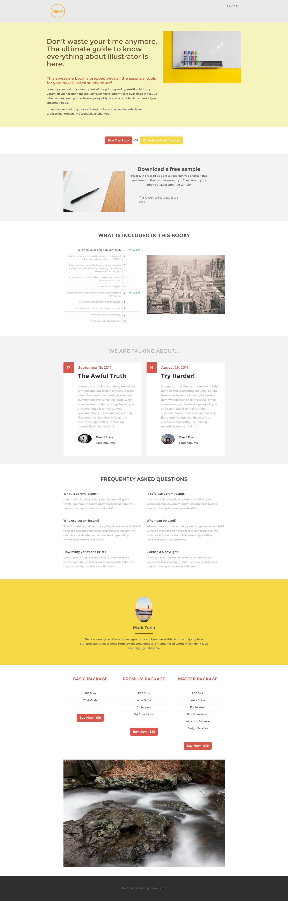

# Vorlage 12a {#template-12a}

Klicken Sie mit der rechten Maustaste, um [Vorlage 12A herunterzuladen](https://51837-micrositemarketo.adobeio-static.net/lp-templates/template-12a.html)

Diese Vorlage enthält den folgenden Inhalt:

* Eine Kopfzeile (optional)
* Ein primärer Abschnitt

  * Enthält Hero-Titel, Hero-Text und Hero-Bild

* Sechs Karosserieabschnitte (optional)
* Fußzeile (optional)

**Klicken Sie unten mit der rechten Maustaste, um diese Vorlage herunterzuladen:**

[Vorlage 12A.html](https://51837-micrositemarketo.adobeio-static.net/lp-templates/template-12a.html)
