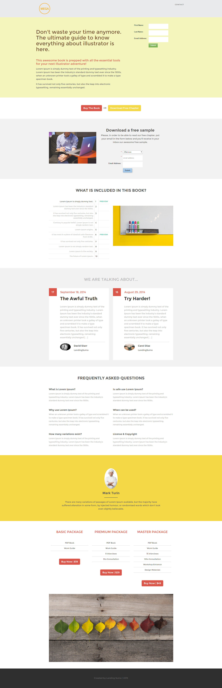

# Vorlage 12d {#template-12d}

Rechtsklick zum Herunterladen [Vorlage 12D](https://experienceleague.adobe.com/landing/marketo/lp-templates/template-12d.html)

Diese Vorlage enthält den folgenden Inhalt:

* Eine Kopfzeile (optional)
* Ein primärer Abschnitt

   * Enthält Hero-Titel, Hero-Text und Formular

* Sechs Karosserieabschnitte (optional)
* Fußzeile (optional)

**Klicken Sie unten mit der rechten Maustaste, um diese Vorlage herunterzuladen:**

[Vorlage 12D.html](https://experienceleague.adobe.com/landing/marketo/lp-templates/template-12d.html)
