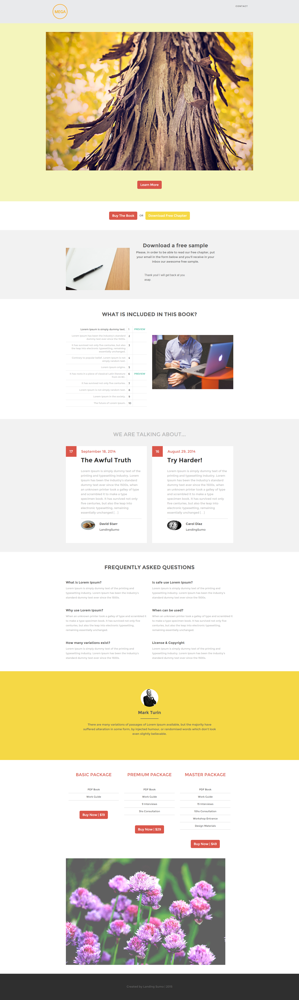

# Vorlage 12f {#template-12f}

Rechtsklick zum Herunterladen [Vorlage 12F](https://experienceleague.adobe.com/landing/marketo/lp-templates/template-12f.html)

Diese Vorlage enthält den folgenden Inhalt:

* Eine Kopfzeile (optional)
* Ein primärer Abschnitt

   * enthält Hero-Bild und Link „Mehr erfahren“

* Sechs Karosserieabschnitte (optional)
* Fußzeile (optional)

**Klicken Sie unten mit der rechten Maustaste, um diese Vorlage herunterzuladen:**

[Vorlage 12F.html](https://experienceleague.adobe.com/landing/marketo/lp-templates/template-12f.html)
