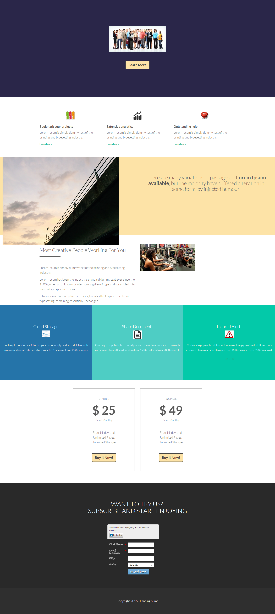

# Vorlage 13e {#template-13e}

Rechtsklick zum Herunterladen [Vorlage 13E](https://experienceleague.adobe.com/landing/marketo/lp-templates/template-13e.html?lang=de)

Diese Vorlage enthält den folgenden Inhalt:

* Ein primärer Abschnitt

   * enthält Hero-Bild und Schaltfläche „Weitere Informationen“

* Fünf Hauptteilabschnitte (optional)
* Fußzeile (optional)

**Klicken Sie unten mit der rechten Maustaste, um diese Vorlage herunterzuladen:**

[Vorlage 13E.html](https://experienceleague.adobe.com/landing/marketo/lp-templates/template-13e.html?lang=de)
