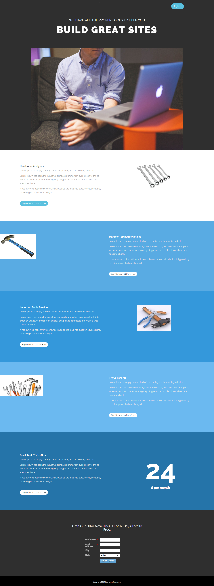

# Vorlage 15a {#template-15a}

Klicken Sie mit der rechten Maustaste, um [Vorlage 15A herunterzuladen](https://experienceleague.adobe.com/landing/marketo/lp-templates/template-15a.html?lang=de)

Diese Vorlage enthält den folgenden Inhalt:

* Ein primärer Abschnitt

   * Enthält Hero-Titel und Hero-Bild

* Fünf Hauptteilabschnitte (optional)
* Fußzeile (optional)

**Klicken Sie unten mit der rechten Maustaste, um diese Vorlage herunterzuladen:**

[template 15a.html](https://experienceleague.adobe.com/landing/marketo/lp-templates/template-15a.html?lang=de)
