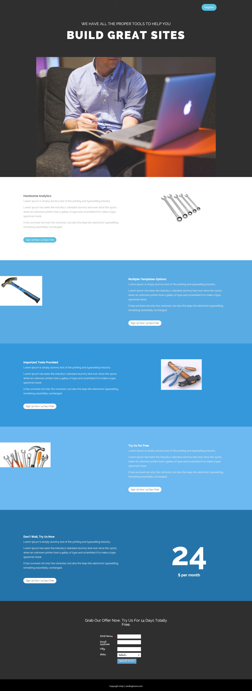

# Vorlage 15a {#template-15a}

Klicken Sie mit der rechten Maustaste, um [Vorlage 15A herunterzuladen](https://51837-micrositemarketo.adobeio-static.net/lp-templates/template-15a.html)

Diese Vorlage enthält den folgenden Inhalt:

* Ein primärer Abschnitt

  * Enthält Hero-Titel und Hero-Bild

* Fünf Hauptteilabschnitte (optional)
* Fußzeile (optional)

**Klicken Sie unten mit der rechten Maustaste, um diese Vorlage herunterzuladen:**

[Vorlage 15a.html](https://51837-micrositemarketo.adobeio-static.net/lp-templates/template-15a.html)
