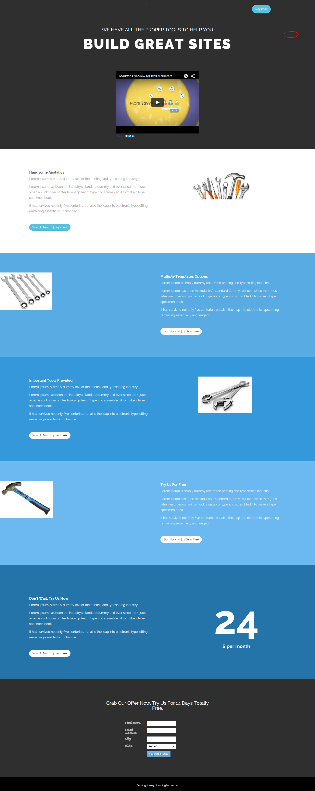

# Vorlage 15b {#template-15b}

Klicken Sie mit der rechten Maustaste, um [Vorlage 15B herunterzuladen](https://experienceleague.adobe.com/landing/marketo/lp-templates/template-15b.html)

Diese Vorlage enthält den folgenden Inhalt:

* Ein primärer Abschnitt

   * Enthält Hero-Titel und Video

* Fünf Hauptteilabschnitte (optional)
* Fußzeile (optional)

**Klicken Sie unten mit der rechten Maustaste, um diese Vorlage herunterzuladen:**

[Vorlage 15B.html](https://experienceleague.adobe.com/landing/marketo/lp-templates/template-15b.html)
