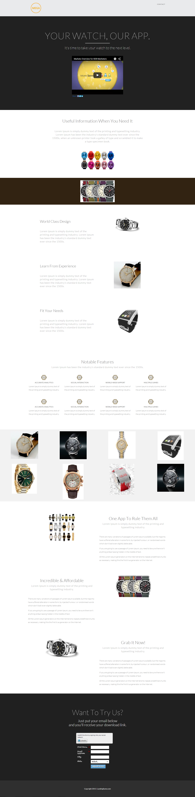

# Vorlage 16b {#template-16b}

Klicken Sie mit der rechten Maustaste, um [Vorlage 16B herunterzuladen](https://51837-micrositemarketo.adobeio-static.net/lp-templates/template-16b.html)

Diese Vorlage enthält den folgenden Inhalt:

* Eine Kopfzeile (optional)
* Ein primärer Abschnitt

  * Enthält Hero-Titel und Video

* Sechs Karosserieabschnitte

**Klicken Sie unten mit der rechten Maustaste, um diese Vorlage herunterzuladen:**

[Vorlage 16B.html](https://51837-micrositemarketo.adobeio-static.net/lp-templates/template-16b.html)
