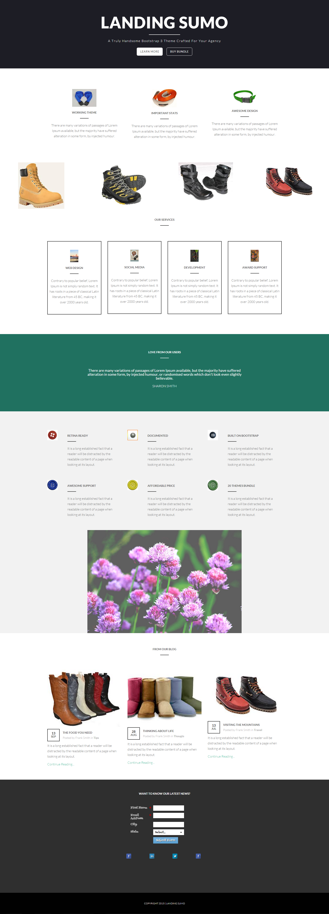

# Vorlage 17-A {#template-a}

Klicken Sie mit der rechten Maustaste auf [Vorlage 17-A](http://docs.marketo.com/download/attachments/9438191/template-17a.html?version=1&amp;modificationdate=1439842942000&amp;api=v2) herunterladen

Diese Vorlage enthält den folgenden Inhalt:

* Ein primärer Abschnitt

   * enthält Heldentitel, Heldentext und zwei Schaltflächen

* Sechs Abschnitte (optional)
* Fußzeile (optional)

**Klicken Sie mit der rechten Maustaste unten, um diese Vorlage herunterzuladen:**

[Template17-A.html](http://docs.marketo.com/download/attachments/9438191/template-17a.html?version=1&amp;modificationdate=1439842942000&amp;api=v2)
