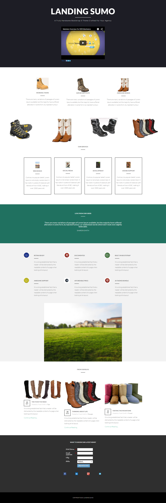

# Meldebogen 17b {#template-17b}

Klicken Sie mit der rechten Maustaste, um [Vorlage 17B herunterzuladen](https://experienceleague.adobe.com/landing/marketo/lp-templates/template-17b.html?lang=de)

Diese Vorlage enthält den folgenden Inhalt:

* Ein primärer Abschnitt

   * Enthält Hero-Titel, Hero-Text und Video

* Sechs Karosserieabschnitte (optional)
* Fußzeile (optional)

**Klicken Sie unten mit der rechten Maustaste, um diese Vorlage herunterzuladen:**

[Vorlage 17B.html](https://experienceleague.adobe.com/landing/marketo/lp-templates/template-17b.html?lang=de)
