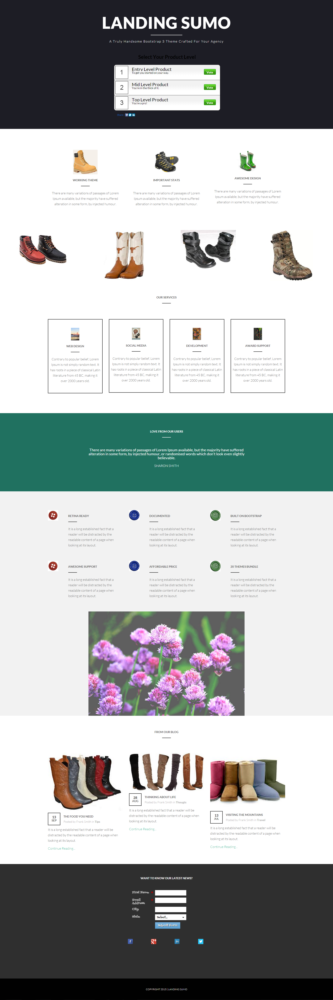

# Meldebogen 17c {#template-17c}

Rechtsklick zum Herunterladen [Vorlage 17C](https://experienceleague.adobe.com/landing/marketo/lp-templates/template-17c.html)

Diese Vorlage enthält den folgenden Inhalt:

* Ein primärer Abschnitt

   * Enthält Hero-Titel, Hero-Text und eine Umfrage

* Sechs Karosserieabschnitte (optional)
* Fußzeile (optional)

**Klicken Sie unten mit der rechten Maustaste, um diese Vorlage herunterzuladen:**

[Vorlage 17c.html](https://experienceleague.adobe.com/landing/marketo/lp-templates/template-17c.html)
