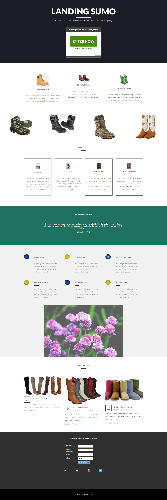

# Vorlage 17-D {#template-17d}

Rechtsklick zum Herunterladen [Vorlage 17-D](https://experienceleague.adobe.com/landing/marketo/lp-templates/template-17d.html)

Diese Vorlage enthält den folgenden Inhalt:

* Ein primärer Abschnitt

   * Enthält Hero-Titel, Hero-Text und Gewinnspiele

* Sechs Karosserieabschnitte (optional)
* Fußzeile (optional)

**Klicken Sie unten mit der rechten Maustaste, um diese Vorlage herunterzuladen:**

[Vorlage 17-d.html](https://experienceleague.adobe.com/landing/marketo/lp-templates/template-17d.html)
