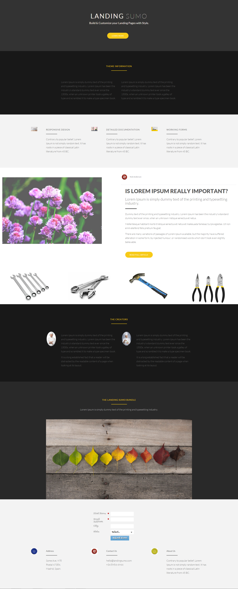

# Vorlage 19a {#template-19a}

Klicken Sie mit der rechten Maustaste, um [Vorlage 19A herunterzuladen](https://experienceleague.adobe.com/landing/marketo/lp-templates/template-19a.html?lang=de)

Diese Vorlage enthält den folgenden Inhalt:

* Ein primärer Abschnitt

   * Enthält Hero-Titel, Hero-Text und Schaltfläche

* Fünf Hauptteilabschnitte (optional)
* Fußzeile

**Klicken Sie unten mit der rechten Maustaste, um diese Vorlage herunterzuladen:**

[Vorlage 19A.html](https://experienceleague.adobe.com/landing/marketo/lp-templates/template-19a.html?lang=de)
