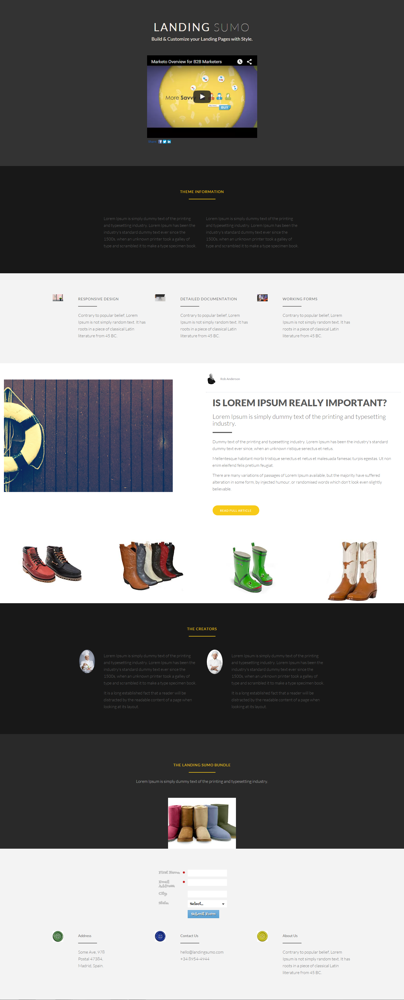

# Vorlage 19b {#template-19b}

Klicken Sie mit der rechten Maustaste, um [Vorlage 19B herunterzuladen](https://51837-micrositemarketo.adobeio-static.net/lp-templates/template-19b.html)

Diese Vorlage enthält den folgenden Inhalt:

* Ein primärer Abschnitt

  * Enthält Hero Title, Hero Text und Hero Video

* Fünf Hauptteilabschnitte (optional)
* Fußzeile (optional)

**Klicken Sie unten mit der rechten Maustaste, um diese Vorlage herunterzuladen:**

[Vorlage 19B.html](https://51837-micrositemarketo.adobeio-static.net/lp-templates/template-19b.html)
