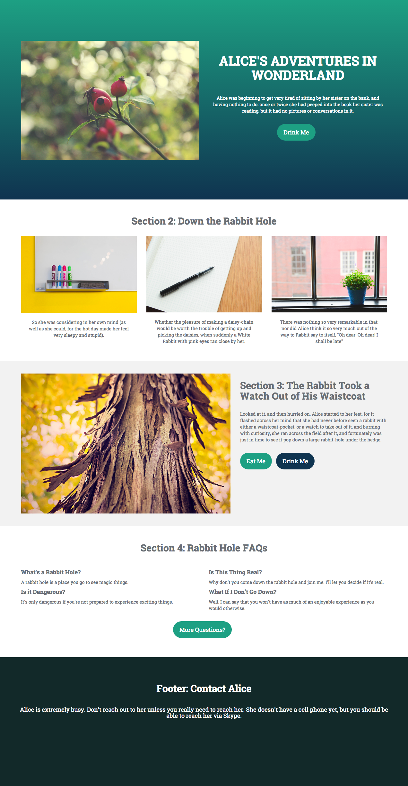

# Vorlage 1a {#template-1a}

Rechtsklick zum Herunterladen [Vorlage 1A](https://experienceleague.adobe.com/landing/marketo/lp-templates/template-1a.html)

Diese Vorlage enthält den folgenden Inhalt:

* Ein primärer Abschnitt

  * Enthält Hero-Bild, Kopfzeile, Textkörper und Schaltfläche.

* Drei Hauptteilabschnitte (optional)
* Fußzeile (optional)

**Klicken Sie unten mit der rechten Maustaste, um diese Vorlage herunterzuladen:**

[Vorlage 1A.html](https://experienceleague.adobe.com/landing/marketo/lp-templates/template-1a.html)
