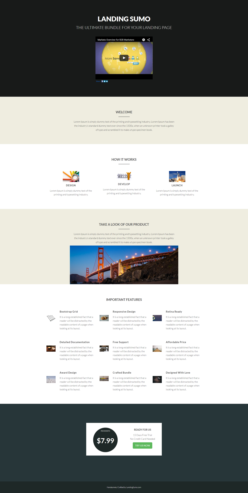

# Vorlage 20b {#template-20b}

Klicken Sie mit der rechten Maustaste, um [Vorlage 20B herunterzuladen](https://experienceleague.adobe.com/landing/marketo/lp-templates/template-20b.html?lang=de)

Diese Vorlage enthält den folgenden Inhalt:

* Ein primärer Abschnitt

   * Enthält Hero-Video und Text

* Vier Karosserieabschnitte (optional)
* Fußzeile (optional)

**Klicken Sie unten mit der rechten Maustaste, um diese Vorlage herunterzuladen:**

[Vorlage 20B.html](https://experienceleague.adobe.com/landing/marketo/lp-templates/template-20b.html?lang=de)
