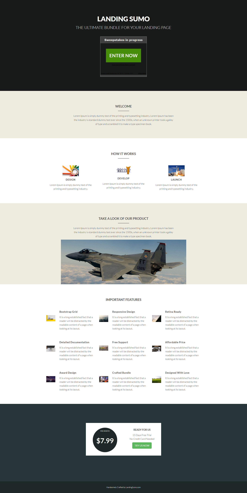

# Vorlage 20d {#template-20d}

Rechtsklick zum Herunterladen [Vorlage 20D](https://experienceleague.adobe.com/landing/marketo/lp-templates/template-20d.html?lang=de)

Diese Vorlage enthält den folgenden Inhalt:

* Ein primärer Abschnitt

   * Enthält Hero-Gewinnspiele und Text

* Vier Karosserieabschnitte (optional)
* Fußzeile (optional)

**Klicken Sie unten mit der rechten Maustaste, um diese Vorlage herunterzuladen:**

[Template 20d.html](https://experienceleague.adobe.com/landing/marketo/lp-templates/template-20d.html?lang=de)
