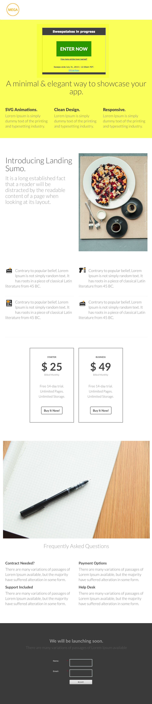

# Vorlage 5e {#template-5e}

Klicken Sie mit der rechten Maustaste [Vorlage 5E herunterladen](https://51837-micrositemarketo.adobeio-static.net/lp-templates/template-5e.html) und wählen Sie **Link speichern unter…**

>[!NOTE]
>
>Die Schritte zum Herunterladen und Importieren einer Vorlage [finden Sie hier](/help/marketo/product-docs/demand-generation/landing-pages/landing-page-templates/guided-landing-page-template-list.md#how-to-import){target="_blank"}.

Diese Vorlage enthält den folgenden Inhalt:

* Eine Kopfzeile (optional)
* Ein primärer Abschnitt

  * Enthält einen Gewinneinsatz, ein Hero-Bild, einen Hero-Titel und 3 Beschreibungsaufzählungszeichen.

* Drei Hauptteilabschnitte (optional)
* Fußzeile (optional)

**Klicken Sie mit der rechten Maustaste unten (und wählen Sie _Link speichern unter…_) So laden Sie diese Vorlage herunter:**

[Vorlage 5e.html](https://51837-micrositemarketo.adobeio-static.net/lp-templates/template-5e.html)
