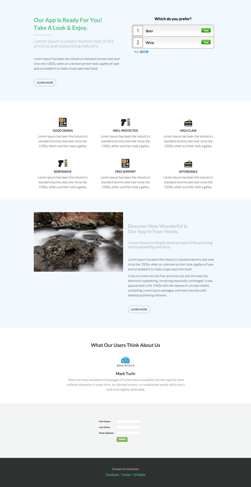

# Vorlage 6c {#template-6c}

Rechtsklick zum Herunterladen [Vorlage 6C](https://experienceleague.adobe.com/landing/marketo/lp-templates/template-6c.html)

Diese Vorlage enthält den folgenden Inhalt:

* Ein primärer Abschnitt

   * Enthält Hero Poll, Title, Subtitle, Body Text und Button.

* Vier Karosserieabschnitte (optional)
* Fußzeile (optional)

**Klicken Sie unten mit der rechten Maustaste, um diese Vorlage herunterzuladen:**

[Vorlage 6C.html](https://experienceleague.adobe.com/landing/marketo/lp-templates/template-6c.html)
