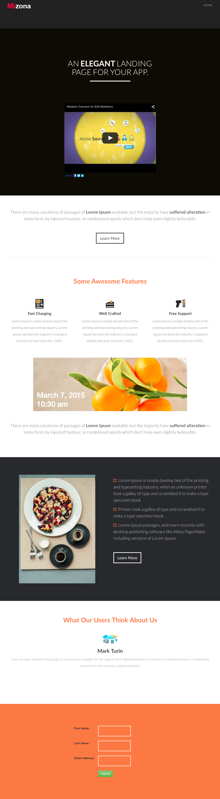

# Vorlage 7B {#template-7b}

Klicken Sie mit der rechten Maustaste auf [Vorlage herunterladen 7B](https://experienceleague.adobe.com/landing/marketo/lp-templates/template-7b.html)

Diese Vorlage enthält den folgenden Inhalt:

* Kopfzeile (optional)
* Ein primärer Abschnitt

   * enthält eine Kopfzeile und ein Video

* Vier Hauptteilabschnitte (optional)
* Fußzeile (optional)

**Klicken Sie mit der rechten Maustaste unten, um diese Vorlage herunterzuladen:**

[Vorlage 7B.html](https://experienceleague.adobe.com/landing/marketo/lp-templates/template-7b.html)
