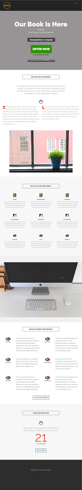

# Vorlage 8f {#template-8f}

Rechtsklick zum Herunterladen [Vorlage 8F](https://experienceleague.adobe.com/landing/marketo/lp-templates/template-8f.html?lang=de)

Diese Vorlage enthält den folgenden Inhalt:

* Eine Kopfzeile (optional)
* Ein primärer Abschnitt

   * Enthält eine Hero-Kopfzeile, einen Hero-Text und einen Gewinneinsatz

* Fünf Hauptteilabschnitte (optional)
* Eine Fußzeile (optional)

**Klicken Sie unten mit der rechten Maustaste, um diese Vorlage herunterzuladen:**

[Vorlage 8F.html](https://experienceleague.adobe.com/landing/marketo/lp-templates/template-8f.html?lang=de)
