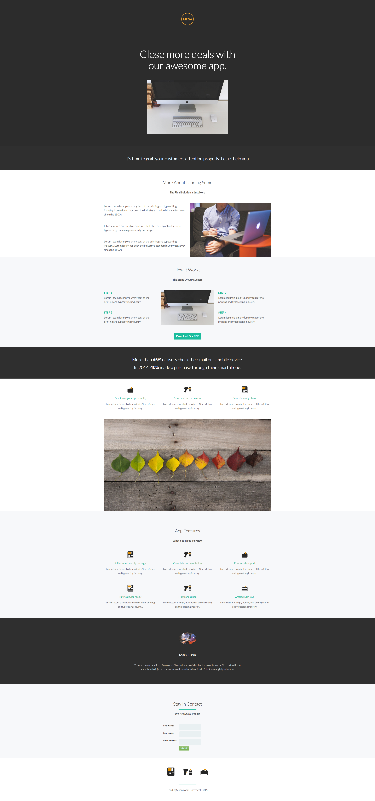

# Vorlage 9b {#template-9b}

Rechtsklick zum Herunterladen [Vorlage 9B](https://experienceleague.adobe.com/landing/marketo/lp-templates/template-9b.html)

Diese Vorlage enthält den folgenden Inhalt:

* Ein primärer Abschnitt

   * Enthält ein Logo-Bild, eine Hero-Kopfzeile und ein Hero-Bild

* Acht Hauptteilabschnitte (optional)
* Eine Fußzeile (optional)

**Klicken Sie unten mit der rechten Maustaste, um diese Vorlage herunterzuladen:**

[Vorlage 9B.html](https://experienceleague.adobe.com/landing/marketo/lp-templates/template-9b.html)
