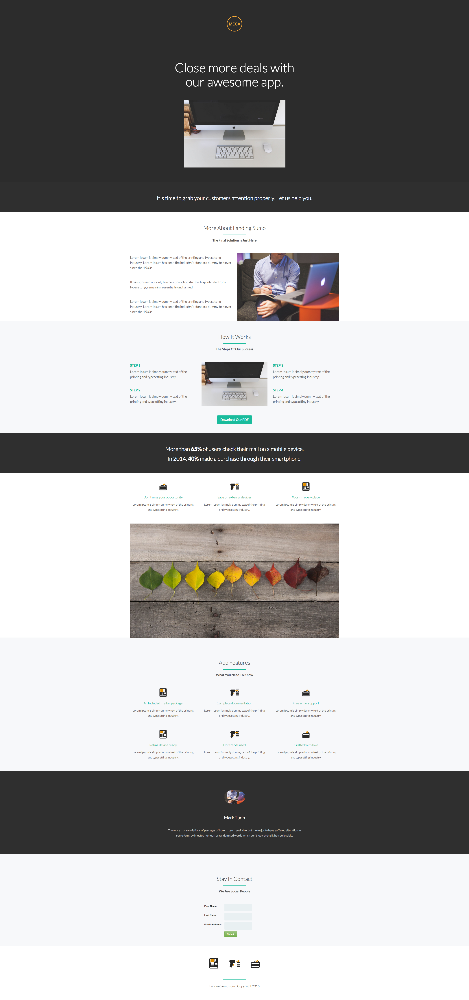

# Vorlage 9B {#template-9b}

Klicken Sie mit der rechten Maustaste auf [Vorlage herunterladen 9B](https://experienceleague.adobe.com/landing/marketo/lp-templates/template-9b.html)

Diese Vorlage enthält den folgenden Inhalt:

* Ein primärer Abschnitt

   * enthält ein Logo-Bild, eine Heldenkopfzeile und ein Heldenbild

* Acht Hauptabschnitte (optional)
* Fußzeile (optional)

**Klicken Sie mit der rechten Maustaste unten, um diese Vorlage herunterzuladen:**

[Vorlage 9B.html](https://experienceleague.adobe.com/landing/marketo/lp-templates/template-9b.html)
