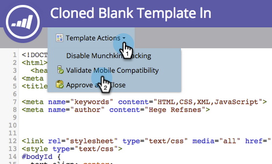

# Vorhandene Freiform-Landingpage-Vorlage für Mobilgeräte kompatibel machen {#make-an-existing-free-form-landing-page-template-mobile-compatible}

Dies kann an zwei Stellen erfolgen: im Vorlagen-Editor und im Landingpage-Editor.

## Aktualisierung vom Vorlagen-Editor {#upgrade-from-the-template-editor}

1. Wechseln Sie zu **Design Studio**.

   

1. Wählen Sie **Vorlagen** aus.

   

1. Wählen Sie eine Vorlage aus, bei der **Mobile kompatibel** **Nein** ist.

   

1. Klicken Sie auf **Entwurf bearbeiten**.

   

1. Klicken Sie auf **Kompatibel mit Mobilgeräten gestalten**.

   

1. Klicken Sie auf **Upgrade**.

   

   Ihre Landingpage-Vorlage ist jetzt mit Mobilgeräten kompatibel!

   >[!NOTE]
   >
   >Die Aktualisierung sollte harmlos sein. Achten Sie jedoch darauf, die Seiten auf Abweichungen zu überprüfen. Durch die Aktualisierung werden Entwürfe von Landingpages erstellt, die diese Vorlage verwenden.

   

## Was macht eine Vorlage für Mobilgeräte kompatibel? {#what-makes-a-template-mobile-compatible}

Große Fragen! Ihre Vorlage muss die folgenden Tags aufweisen:

`Must have <!DOCTYPE HTML> Must have a <HEAD> element Must have a <TITLE> in the <HEAD> element Must have <META CHARSET="UTF-8"> within the <HEAD> element Must have a <BODY> element that contains one (and only one) 

`

Wenn alles gut aussieht, wirst du diese Nachricht sehen.

Wenn etwas nicht stimmt, wird eine Fehlermeldung angezeigt. Klicken Sie auf &quot;Reparieren&quot;, um das Problem zu beheben, und wiederholen Sie den Validierungsprozess.

Wenn Sie Änderungen an der Vorlage vornehmen, klicken Sie auf Vorlagenaktionen und wählen Sie &quot;Mobile Kompatibilität überprüfen&quot;.

## Aktualisieren einer Vorlage über den Freiform-Landingpage-Editor {#upgrading-a-template-from-the-free-form-landing-page-editor}

Wenn Sie eine Landingpage bearbeiten und auf die Registerkarte &quot;Mobil&quot;klicken, werden Sie manchmal feststellen, dass die Vorlage nicht aktualisiert wurde. Keine Angst! Sie können es direkt dort aktualisieren.

1. Klicken Sie auf die Registerkarte **Mobil**.

   

1. Klicken Sie auf das Kontrollkästchen und dann auf **Aktivieren**.

   

   >[!NOTE]
   >
   >Durch die Aktivierung der mobilen Version einer Vorlage werden Entwürfe von Landingpages erstellt, die diese verwenden.

Fantastisch! Sie können jetzt [die Mobile-Ansicht](/help/marketo/product-docs/demand-generation/landing-pages/free-form-landing-pages/customize-mobile-view-for-your-free-form-landing-page.md) aller Landingpages anpassen, die diese Vorlage verwenden.
