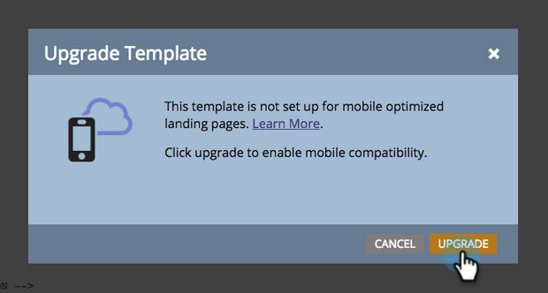
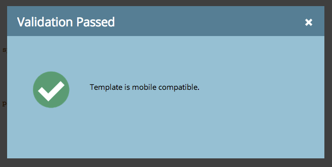

# Erstellen einer vorhandenen Freiform-Landingpage-Vorlage [!UICONTROL Mobile-kompatibel] {#make-an-existing-free-form-landing-page-template-mobile-compatible}

Dies kann an zwei Stellen geschehen, im Vorlagen-Editor und im Landingpage-Editor.

## Aktualisieren aus dem Vorlageneditor {#upgrade-from-the-template-editor}

1. Gehen Sie zum **[!UICONTROL Design Studio]**.

   

1. Wählen Sie **[!UICONTROL Vorlagen]** aus.

   

1. Wählen Sie eine Vorlage aus **[!UICONTROL bei der „Mobile]**&quot; **[!UICONTROL Nein]** ist.

   

1. Klicken Sie **[!UICONTROL Entwurf bearbeiten]**.

   

1. Klicken Sie auf **[!UICONTROL Mobile kompatibel machen]**.

   

1. Klicken Sie auf **[!UICONTROL Aktualisieren]**.

   

   Ihre Landingpage-Vorlage ist jetzt mobil kompatibel!

   >[!NOTE]
   >
   >Ein Upgrade sollte harmlos sein, aber stellen Sie sicher, dass Sie die Seiten auf Diskrepanzen überprüfen. Beim Upgrade werden Entwürfe aller Landingpages erstellt, die diese Vorlage verwenden.

   

## Was macht eine Vorlage [!UICONTROL Mobile kompatibel]? {#what-makes-a-template-mobile-compatible}

Gute Fragen! Ihre Vorlage muss über die folgenden Tags verfügen:

`Must have <!DOCTYPE HTML> Must have a <HEAD> element Must have a <TITLE> in the <HEAD> element Must have <META CHARSET="UTF-8"> within the <HEAD> element Must have a <BODY> element that contains one (and only one) 

`

Wenn alles gut aussieht, wirst du diese Nachricht sehen.

Wenn ein Fehler auftritt, wird eine Fehlermeldung angezeigt. Klicken Sie auf „Reparieren“, um das Problem zu beheben, und wiederholen Sie den Validierungsprozess.

Wenn Sie Änderungen an der Vorlage vornehmen, klicken Sie auf [!UICONTROL Vorlagenaktionen] und wählen Sie [!UICONTROL Kompatibilität mit Mobilgeräten überprüfen].

## Aktualisieren einer Vorlage im Freiform-Landingpage-Editor {#upgrading-a-template-from-the-free-form-landing-page-editor}

Wenn Sie eine Landingpage bearbeiten und auf die Registerkarte Mobile klicken, werden Sie manchmal feststellen, dass die Vorlage nicht aktualisiert wurde. Fürchte dich nicht! Sie können es direkt hier aktualisieren.

1. Klicken Sie auf **[!UICONTROL Registerkarte]** Mobil“.

   

1. Aktivieren Sie das Kontrollkästchen und klicken Sie auf **[!UICONTROL Aktivieren]**.

   

   >[!NOTE]
   >
   >Durch die Aktivierung der mobilen Version einer Vorlage werden Entwürfe für alle Landingpages erstellt, die diese verwenden.

Fantastisch! Sie können jetzt [die mobile Ansicht](/help/marketo/product-docs/demand-generation/landing-pages/free-form-landing-pages/customize-mobile-view-for-your-free-form-landing-page.md) aller Landingpages anpassen, die diese Vorlage verwenden.
