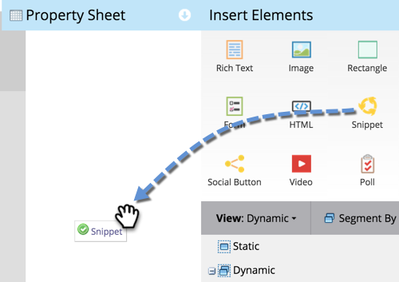

# Hinzufügen eines Ausschnitts zu einer Landingpage {#add-a-snippet-to-a-landing-page}

Snippets sind kleine Teile von HTML, die Regeln folgen und personalisierte Inhalte enthalten können.

>[!PREREQUISITES]
>
>[Erstellen eines Snippets](/help/marketo/product-docs/personalization/segmentation-and-snippets/snippets/create-a-snippet.md)

1. Wählen Sie Ihre Landingpage aus und klicken Sie auf **[!UICONTROL Entwurf bearbeiten]**.

   

1. Ziehen Sie im Landingpage-Editor über das **[!UICONTROL Snippet]**-Element.

   

1. Suchen Sie Ihr Snippet, wählen Sie es aus und klicken Sie auf **[!UICONTROL Speichern]**.

   

   >[!TIP]
   >
   >Wenn Sie Ihren Code-Ausschnitt nicht finden können, stellen Sie sicher, dass er zuerst genehmigt wurde.

   >[!NOTE]
   >
   >Wenn Sie ein Snippet zu einer geführten Landingpage hinzufügen möchten, lesen Sie [diesen Artikel](/help/marketo/product-docs/demand-generation/landing-pages/landing-page-templates/create-a-guided-landing-page-template.md).

Tolle Arbeit! Jetzt wissen Sie, wie Sie Ihren Landingpages Snippets hinzufügen.
