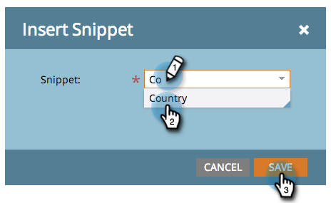

# hinzufügen eines Snippets zu einer Landingpage {#add-a-snippet-to-a-landing-page}

Snippets sind kleine Teile von HTML, die Regeln befolgen und personalisierte Inhalte enthalten können.

>[!PREREQUISITES]
>
>[Snippet erstellen](/help/marketo/product-docs/personalization/segmentation-and-snippets/snippets/create-a-snippet.md)

1. Wählen Sie Ihre Landingpage aus und klicken Sie auf **Entwurf bearbeiten**.

   

1. Ziehen Sie im Landingpages-Editor über das Element **Snippet**.

   

1. Suchen Sie nach Ihrem Snippet, wählen Sie es aus und klicken Sie auf **Speichern**.

   

   >[!TIP]
   >
   >Wenn Sie Ihr Snippet nicht finden können, stellen Sie sicher, dass es zuerst genehmigt wurde.

   >[!NOTE]
   >
   >Wenn Sie ein Snippet zu einer Guided-Landingpage hinzufügen möchten, lesen Sie [diesen Artikel](/help/marketo/product-docs/demand-generation/landing-pages/landing-page-templates/create-a-guided-landing-page-template.md).

Tolle Arbeit! Jetzt wissen Sie, wie Sie Ihren Landingpages Snippets hinzufügen können.
