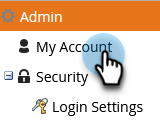

# Hinzufügen zusätzlicher CNAMEs zu einer Landingpage {#add-additional-landing-page-cnames}

Sie können CNAMEs für Landingpages hinzufügen, damit verschiedene URLs auf Ihre Marketo-Landingpages verweisen können. Die folgenden Schritte helfen Ihnen bei der Verwaltung mehrerer Domains.

>[!CAUTION]
>
>Cookies können nicht domänenübergreifend freigegeben werden.

>[!TIP]
>
>**Gleiche Top-Level-Domain - Gut! Cookies werden freigegeben**.  **go**.mycompany.com > **info**.mycompany.com
>
>**Verschiedene Domains auf oberster Ebene - Schlecht! Cookies werden _nicht_ freigegeben**.  go.**mycompany**.com > go.**mynewcompany**.com

>[!NOTE]
>
>**Admin-Berechtigungen erforderlich**

1. Navigieren Sie zum Bereich **Admin**.

   

1. Klicken Sie auf **Mein Konto**.

   

1. Scrollen Sie nach unten zu „Support-Informationen“ und kopieren Sie Ihre Munchkin ID.

   

## Anforderung an IT senden {#send-request-to-it}

1. Bitten Sie Ihre IT-Abteilung, den folgenden CNAME einzurichten: (Ersetzen Sie das Wort [CNAME] durch den CNAME Ihrer Wahl und [Munchkin ID] durch den Text aus dem vorherigen Schritt).

   [CNAME].YourCompany.com > [Munchkin ID].mktoweb.com

## Neuen CNAME hinzufügen {#add-a-new-cname}

1. Sobald Ihre IT-Abteilung den CNAME erstellt hat, wechseln Sie zum Bereich **Admin**.

   

1. Klicken Sie auf **Landingpages**.

   

1. Klicken Sie auf **[!UICONTROL Neu]** und wählen Sie **[!UICONTROL Neuer Domain-Alias]**.

   

1. Geben Sie Ihren **[!UICONTROL Domain-Alias]** ein. Die **[!UICONTROL Standardseite]** wird angezeigt, wenn der Besucher keine URL eingibt. Geben Sie an, wohin sie in diesem Fall gehen sollen.

   >[!NOTE]
   >
   >Für die [!UICONTROL Standardseite] können Sie eine Landingpage oder eine externe URL auswählen, z. B. Ihre öffentliche Website.

   

1. Geben Sie Ihre **[!UICONTROL Standardseite]** ein und klicken Sie auf **[!UICONTROL Erstellen]**.

   

Sie wissen jetzt, wie Sie Ihren Landingpages einen CNAME hinzufügen.
